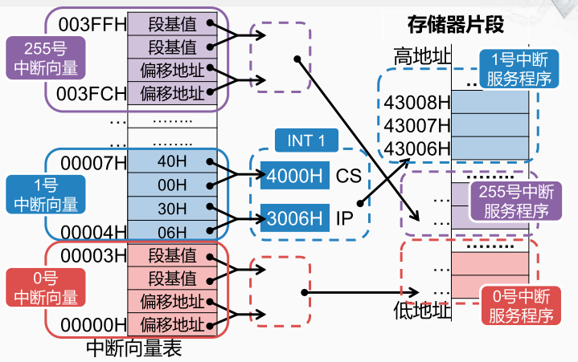

8086的中断处理
8086是一个16位的cpu，内部包含4个16位的通用寄存器。 对外则有16根数据线，20根地址线，寻址的内存空间就是2的20次方，也就是1M byte。 8086采用的是“段加偏移”的方式从16位宽运算器生成20位宽的地址。

8086将内存空间分为中断向量表区、初始化代码区、通用区
* 中断向量表区： 00000H~003FFH （地址最低的 1KB ）一共存放了256个中断向量，每个中断向量占4个字节。这4个字节就指向了对应的中断服务程序的入口地址
* 初始化程序区： FFFF0H~FFFFFH （地址最高的 16B ），用8086cpu复位之后首先从地址FFFF0H 获取指令，然后转移到另一个存放着后续的系统程序的内存空间。 
* 通用区：00400H~FFFEFH，存储一般的程序指令和数据包括用于中断处理的程序，中断服务程序

现在的CPU一般都能够处理多种不同的中断类型，每个中断类型就对应一个中断向量占一共4个字节。 前两个字节用于存放中断服务程序入口的偏移量，后两个字节用于存放中断服务程序的地址的段基址，而且都是低字节在前，高字节在后。 在8086当中或者是后来X86处理器的实模式下， 就需要用CS和IP这一对寄存器，来指定一个内存的地址。 这个地址的产生方式就是叫做段加偏移。 那基于这样的方式，每个中断向量都由两个段基值 和两个向量的偏移地址组成。  

中断向量计算
若中断类型码为 17H ，中断服务程序的入口地址为2340H:7890H ，试指出中断向量表中存放该中断向量的 4个字节单元的地址及内容。
地址由低到高分别为：0000:005CH, 0000:005DH, 0000:005EH, 0000:005FH
对应的内容分别为：90H, 78H, 40H, 23H

386的保护模式

CPU的存储器寻址

在保护模式下，段基址是存放在内存中的。 在内存当中的某个地方，存放着一张表，称为描述服务表。 这张表一共有8192个表项，每个表项由8个字节构成，就被称为一个描述符。
描述符中，第2，3，4个字节和第7个字节这一共4个字节是基地址，对应了实模式下CS寄存器中的内容。除了基地址之外，还包含段界限、权限等。

CPU访问描述符

CS寄存器是16位宽的可以寻址2的16次方个内存单元即64K，每个描述符是8个字节，8192个描述符刚好是64K。因此用CS寄存器就正好可以查找这么多个描述符。 
但是这个描述符表存放的地址并不是从0开始的，所以想要找到对应的描述符，CPU还得知道这个描述符表存放的起始地址。
所以在CPU当中还需要再设置一个新的寄存器，叫"GDTR"，用于保存这张描述符表的起始地址。 
x86的CPU在启动的时候都会先进入实模式，然后在内存的某一个地方，先把这张描述符表填好，并将起始地址设置到GDTR寄存器。
在保护模式下，CPU每次要访问存储器，都得先 CS寄存器的内容，加上GDTR寄存器的内容得到一个地址，用这个地址去访问存储器， 然后取出这个描述符，
再把这个描述符当中4个字节的基地址提取出来， 然后再和指令指针寄存器EIP的内容进行组合，从而得到要访问的存储器地址。 然后再用这个地址去访问存储器，得到想要的指令编码。 

保护模式下访问中断描述表
在保护模式下，中断向量表也就没有放在地址为0的存储器区域了， 而是可以放在内存的任意地方。 而且它的名字也有了一些变化，叫作中断描述符表。 
所以现在，在内存的某一个地方，存放的这张中断描述符表总共有256个描述符。
每个描述符是 8个字节，这8个字节当中，字节0和字节1， 以及字节6，字节7组合起来，一共是32位的地址。而字节2和字节3 则是一个段选择符。 
那么当CPU发生中断时，还是会根据中断类型号来查找这个中断描述符表。 那因为现在中断描述符表的起始地址不是0，所以CPU必须要先知道这个中断描述符表的起始地址。 
那个这起始地址也保存在CPU当中的一个寄存器，称为IDTR，就是中断描述符表的地址寄存器。 这个寄存器的内容也需要由系统初始化软件在建立好中断描述符表后填写进去。 

内部中断类型

除法错中断
* 在执行除法指令后，若所得的商超出了目标寄存器所能表示的范围，比如用数值 0 作除数，则 CPU 立即产生一个类型 0 中断

溢出中断
* 执行 INTO 指令时，若溢出标志位 OF 为 1 ，则将引起类型为 4 的内部中断
* 执行 INTO 指令时，若溢出标志位 OF 为 0 ，则 INTO 指令执行空操作
* INTO 指令通常安排在算术运算指令之后，以便在发生溢出时能及时处理
* 指令 INTO 等同于指令 INT 4

单步中断
* 当标志寄存器的 TF 位置 1 之后， CPU 便处于单步工作方式

* 在单步工作方式下， CPU 每执行完一条指令，就会自动产生一个类型 1 中断，进入类型 1 中断服务程序

* 类型 1 中断服务程序：一般用于显示 CPU 内部各寄存器的内容和一些其它信息，以便进行调试和发现错误

  

断点中断
* 与单步中断类似，断点中断也是一种调试程序的手段，并且常常和单步中断结合使用
* 对一个大的程序，一般先通过断点将程序中的某一错误确定在程序的一小段，再对这一小段程序用单步方式跟踪调试
* 在所有 INT n 形式的指令中，只有断点中断指令 INT 3 是一条单字节长的指令，其它都是两字节指令
* INT 3 的指令编码： $11001100_2$

> 用户程序运行到断点时，执行 INT 3 ，进入断点中断服务程序，通常显示 CPU 各寄存器的值等