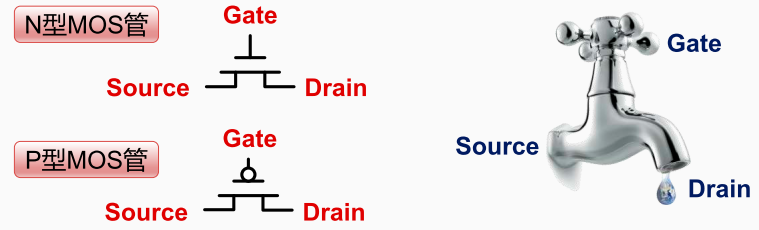

现代计算机的CPU由MOS晶体管，MOS（Metal-Oxide-Semiconductor ：金属 - 氧化物 - 半导体）组成组成的集成电路。CMOS 集成电路（ Complementary MOS ）是由 PMOS 和 NMOS 共同构成的互补型 MOS 集成电路。

NMOS 和 PMOS对外有三个连接，一个是源，一个漏， 一个是门。区别在于

PMOS中当gate端连接低电平时这个晶体管导通，而连接高电平时这个晶体管不导通。

NMOS则与之相反，即当gate端连接低电平时这个晶体管不导通，而连接高电平时这个晶体管导通。

> MOS晶体管其工作原理其实很像这个水龙头，电路中的电流 就好比水管中的水流，水流的来源也就是源， 而水流出的地方就称为漏，控制水流的开关就是门。 如果把门打开，水流就会从源流到漏， 也就相当于晶体管导通，电流可以从源到漏。

[[算术运算与逻辑运算]]

[[频率和时间转换]]

[[构建数据通路]]

[[CPU 控制外设的方式]]

[[多核超线程CPU]]

[[CPU并发架构]]

[[流水线处理器]]