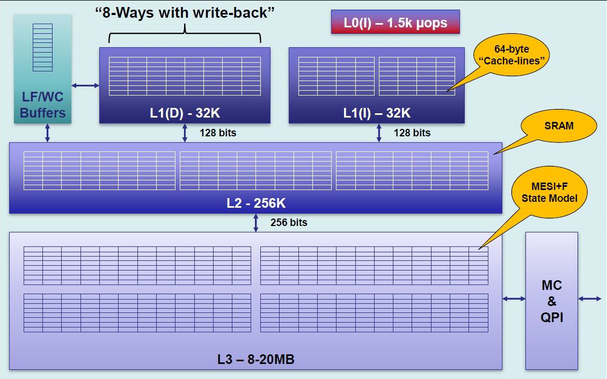

## CPU并发架构

由于CPU的与内存或硬盘的运算速度有几个数量级的差距，因此现代计算机在内存与处理器之间加入一层读写速度尽可能接近处理器的高速缓存。
运算时将需要使用到的数据先从存储器复制到高速缓存中然后CPU直接读写高速缓存。基于高速缓存的存储交互虽然解决了速度差问题却也引入了缓存一致性问题。

> 由于每个处理器都有自己的高速缓存，因此当多个处理器的运算任务都涉及到同一主内存区域时可能导致各自的缓存数据不一致问题。
> 为了解决一致性的问题，就需要各个处理器访问缓存时都遵循一些协议进行操作。包括MSI、MESI（Illinois Protocol）、MOSI、Synapse、Firefly及Dragon Protocol等。
 

高速缓存行（cache lines）为64 字节，
高速缓存行0的地址范围 0 -63，
高速缓存行1的地址范围 64 - 127，
当应用程序需要从内存中读取关键词的时候，高速缓存的硬件会检查所需要的高速缓存行是否在高速缓存中。

[[高速缓存的数据结构]]

[[高速缓存的写入策略]]

[[总线嗅探机制和MESI协议]]
