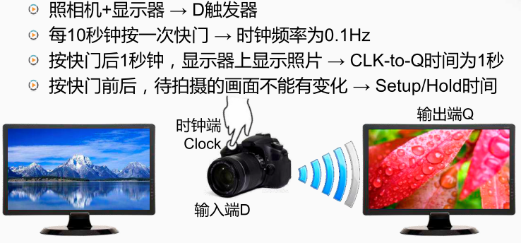

D 触发器
◦ 具有存储信息能力的基本单元
◦ 由若干逻辑门构成，有多种实现方式
◦ 主要有一个数据输入、一个数据输出和一个时钟输入
◦ 在时钟 clock 的上升沿（ 0→1 ），采样输入 D 的值，传送到输出 Q ，其余时间输出 Q 的值不变

照相机和显示器模型

把镜头比作d触发器的输入端D，

拍照的快门比作时钟端clock， 

相机内部通过无线传输将其拍摄的照片传送到一个显示器上，显示器就好比D触发器的输出端Q

clock to Q：从**时钟的上升沿到来开始**直到**数据出现在输出端为止**，D触发器的自身特性。相当于照相机和显示器模型中，按下照相机的快门后，照相机会拍一张照片， 过一秒钟后显示器上显示出这张照片

时钟频率：如果系统的时钟频率是零点一赫兹，则相当于在相机显示器模型中约定 每十秒钟会来按一次快门

D触发器的输入：按一定的时钟频率从上游获取信息并传递输出端Q，相当于在相机显示器模型中的相机的左边增加另一台显示器，然后相机定期拍摄左边显示器上的画面，并将结果显示在后边的显示器。

输入信号的稳定时间： 对于D触发器来说，在时钟上升沿前后很短的时间内，输入端的 信号也不能发生变化。则在相机显示器模型中指在按动快门的前后很短的时间内通过镜头看到的画面不应该发生变动， 否则就可能造成拍出的照片是模糊的。

set up时间：输入信号在时钟上升沿之前的一段很短的稳定时间

hold 时间：输入信号在时钟上升沿之后的一段很短的稳定时间