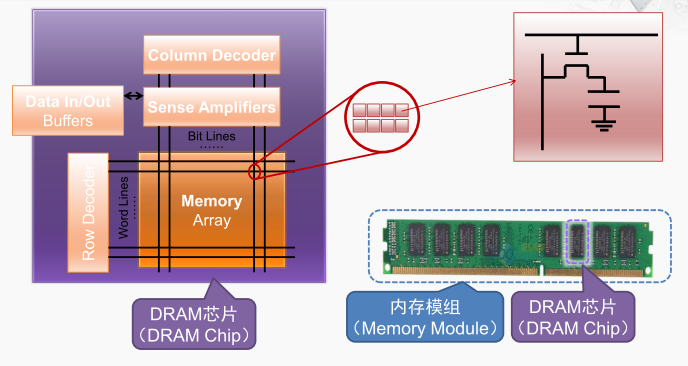
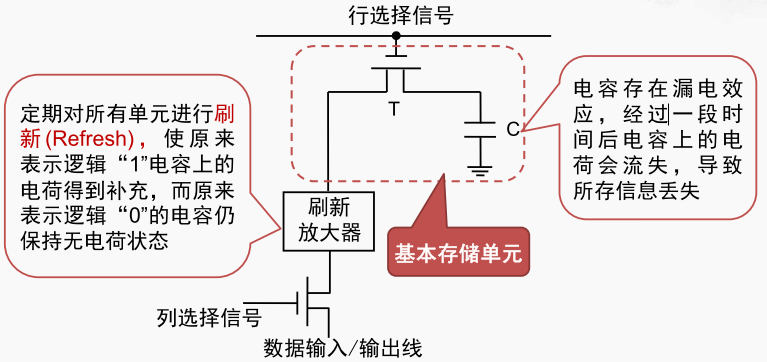

DRAM

**DRAM**（Dynamic Random Access Memory，动态随机存取存储器）的芯片，主要用于PC机中的主存储器也称为内存模组。内存模组由一块小电路板再加上若干的DRAM芯片构成。DRAM芯片以一个存储阵列为核心，以行列的形式组织，行列的交点就是一个存储单元。 每个存储单元都有唯一的一组行列地址，一个存储单元一般由若干个比特构成，常见的有4比特或者8比特。因此，从外部给入了行地址和列地址之后，这些地址会同时送到每一个DRAM芯片（内存模组上的黑色块）， 从而在每个DRAM芯片当中选中对应的一个存储单元。 如果每个DRAM芯片送出8个比特，那它就可以向外同时送出64个比特。 因此，如果从CPU送到内存条一组行列地址， 那内存条就可以返回这组地址所对应的， 一个64位的数。

DRAM 的基本存储单元（ 1 bit ）

基本单元就通过电容c保存了一个比特的信息。如果是写入就是由外部的数据线驱动对电容进行充电或者放电的操作，从而完成写入一或者0。 
那如果是读操作则是由电容对外部的数据信号线进行驱动，从而完成读出0或者一。 

> 容是存在漏电效应的， 如果经过一段时间电容上的电荷流失过多就会丢失它所存的信息。因此为了保证DRAM的存储的信息的正确性需要定期对所有的单元进行刷新。
>
> 常见的内存类型有DDR2 DDR3 DDR4，且都由SDRAM（同步的DRAM）构成。

[[DRAM芯片的读写过程]]