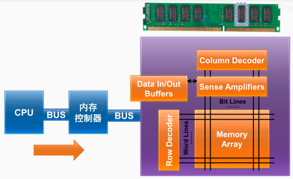
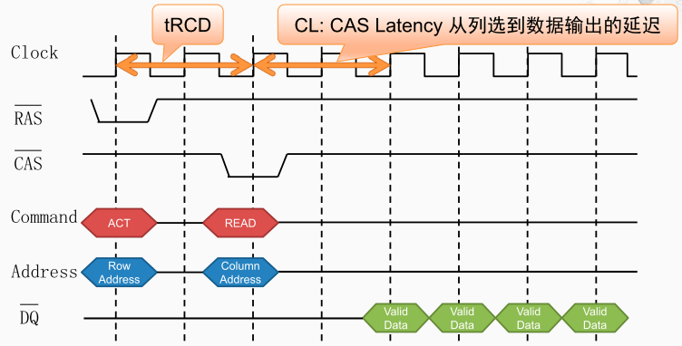
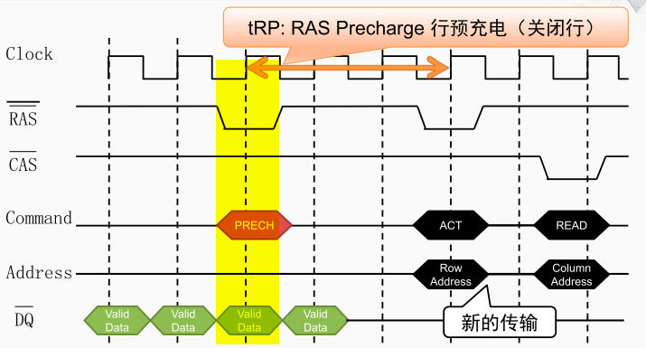
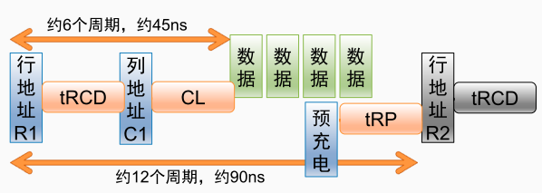

CPU访问内存过程

在计算机内部，CPU通过系统总线连接到了内存控制器，内存控制器将地址线、数据线连接到内存条上的各个DRAM芯片。当CPU需要访问存储器时，首先申请系统总线，在获得总线控制权后会将地址发到内存控制器中。然后内存控制器会将这个地址进行分解成行地址和列地址等。

通过存储总线发出的行地址会被DRAM芯片中的行译码器解析，并从存储阵列中选出对应行，然后将这一行当中的所有的存储单元的信号进行放大后放入到一个缓冲区中，这个过程称为行访问的过程。 

当行缓冲区的信号都稳定后就发出列地址由DRAM芯片中的列译码器解析，并从存储阵列中选出对应的列，然后将存储单元的数据发送到数据输出接口。这个过程被称为列访问的过程。

SDRAM关键参数
tRCD，从行选到列选的延迟时间，在PC133这个标准当中，大约15到23个纳秒， 因为PC133标准的时钟频率是133兆赫兹， 所以相当于2到3个时钟周期。 
CL，从列选到数据输出的延迟时钟周期数，在PC133标准中是2到3个时钟周期，大约15到23纳秒。 
tRP，行预充电的延迟时间。 同样在PC133标准当中，大约是15到23个纳秒，相当于2到3个时钟周期。 

> 预充电：如果当前需要访问的数据与上一次需要的数据不在同一行，则需要将上次行访问中读取到缓冲中的数据进行关闭。这个关闭的过程称之为预充电

数据读取的过程如下

