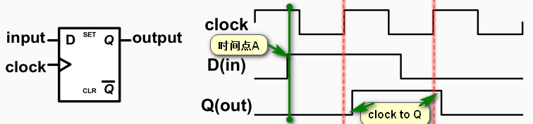
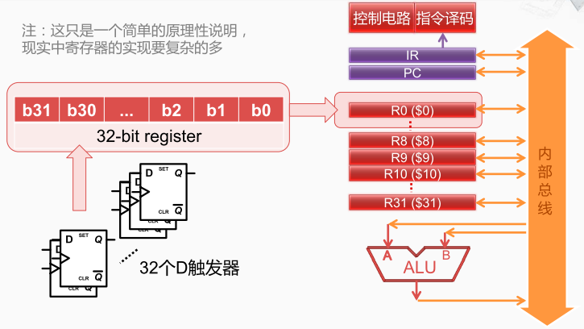

D触发器的工作原理 

时钟信号Clock：有规律的进行变化。时钟周期：两个上升沿之间的间隔时间。

输入信号D则可能在任何时候发生变化， 比如在时间点A它由0变到了1， 但是因为时钟上升沿没有到来，所以输出端Q 并没有发生变化，

直到时钟上升沿到来的时候， D触发器会采样输入端的信号， 并经过很短的clock to Q的时间在输出端体现出来， 因为这时候输入端是1，所以输出端也变成了1， 

然后时间再继续，在这个时钟周期内，输入D又发生了变化，由1变成了0， 但是同样输出端Q没有发生变化， 直到下一个时钟上升沿到来，采样到了新的输入端的指令， 再经过Clock to Q输出端也变成了0。

如果把很多个D触发器 组合起来，比如就是这32个D触发器， 那就可以构成一个32位的寄存器

时钟信号：指晶体振荡器生成的电路信号