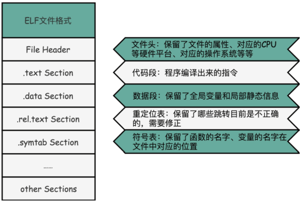

ELF （Executable and Linking Format）可执行与可链接文件格式，Linux环境下的目标代码、以及可执行代码

1. 文件头，File Header：用来表示文件的基本属性，比如是否是可执行文件，对应的 CPU、操作系统等等
2. **代码段**或者指令段（Code Section），text Section：用来保存程序的代码和指令；
3. **数据段**（Data Section），.data Section：用来保存全局变量和局部静态变量
4. **重定位表**（Relocation Table），.rel.text Secion。用来保留当前的文件里不确定的跳转地址
5. **符号表**（Symbol Table），.symtab Section。用来保留当前文件里面定义的函数名称和对应地址的地址

