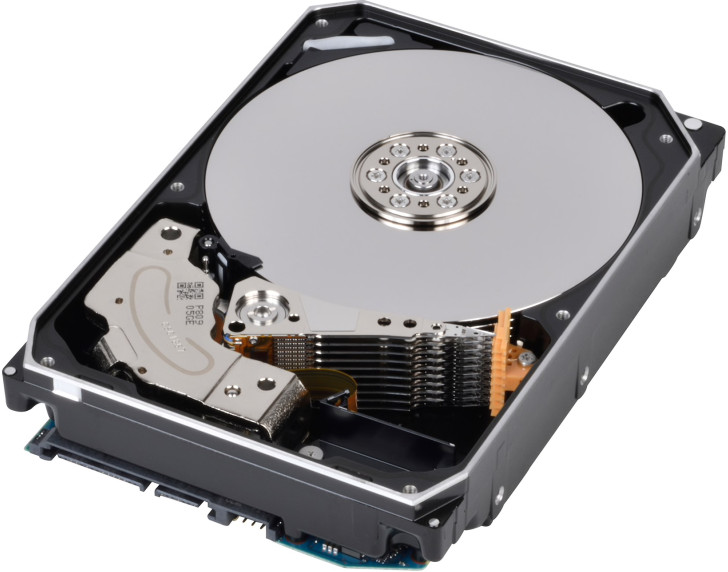

HDD磁盘

磁盘结构

一块机械硬盘是由盘面、磁头和悬臂三个部件组成的。

- 盘面（Disk Platter）：盘面其实就是我们实际存储数据的盘片，盘面本身通常是用的铝、玻璃或者陶瓷这样的材质做成的光滑盘片。盘面上有一层磁性的涂层，数据存储在这层涂层上。盘面中间有一个受电机控制的转轴。这个转轴会控制我们的盘面去旋转。

  > 磁盘的转速：指盘面中间电机控制的转轴的旋转速度，英文单位叫**RPM**，也就是**每分钟的旋转圈数**（Rotations Per Minute）。

- 磁头（Drive Head）：通过磁头，从盘面上读取到数据然后再通过电路信号传输给控制电路、接口，再到总线上。

  > 通常一个盘面上会有两个磁头，分别在盘面的正反面。盘面在正反两面都有对应的磁性涂层来存储数据。且一块硬盘也是由上下堆叠了很多个盘面，各个盘面之间是平行的。每个盘面的正反两面都有对应的磁头。
  >
  > 而其存储信息的方式就是通过盘片表面的磁性物质来存储数据。把盘片放在显微镜下放大，可以看到盘片表面是凹凸不平的，凸起的地方被磁化，代表数字 1，凹的地方没有被磁化，代表数字 0，因此硬盘可以通过二进制的形式来存储表示文字、图片等的信息。

- 悬臂（Actuator arm）：链接在磁头上，并且在一定范围内会去把磁头定位到盘面的某个特定的磁道（Track）上。

  > 一个盘面通常是圆形的，由很多个同心圆组成。每一圈都是一个磁道，且每个磁道都有自己的一个编号。悬臂其实控制磁头读取哪个磁道。

- 磁道（Track）：盘面上的圆形带状区域，一个盘面可以有多个磁道；

- 扇区（Track Sector）：磁道上的一个弧段，一个磁道可以有多个扇区，它是最小的物理储存单位，目前主要有 512 bytes 与 4 K 两种大小；

  > 磁道，会分成一个一个扇区（Sector）上下平行的一个一个盘面的相同扇区呢，我们叫作一个柱面（Cylinder）。
  >
  > 

- 主轴（Spindle）：使整个盘面转动。

[[HDD磁盘IO过程]]

[[磁盘调度算法]]

[[SSD磁盘]]