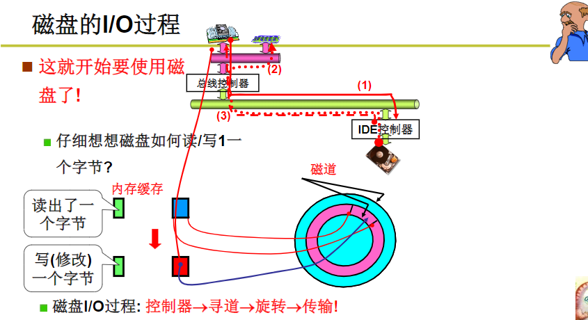
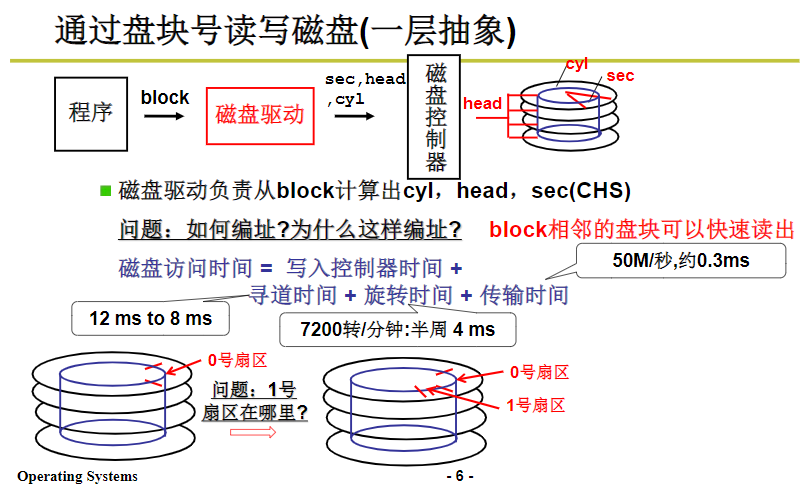
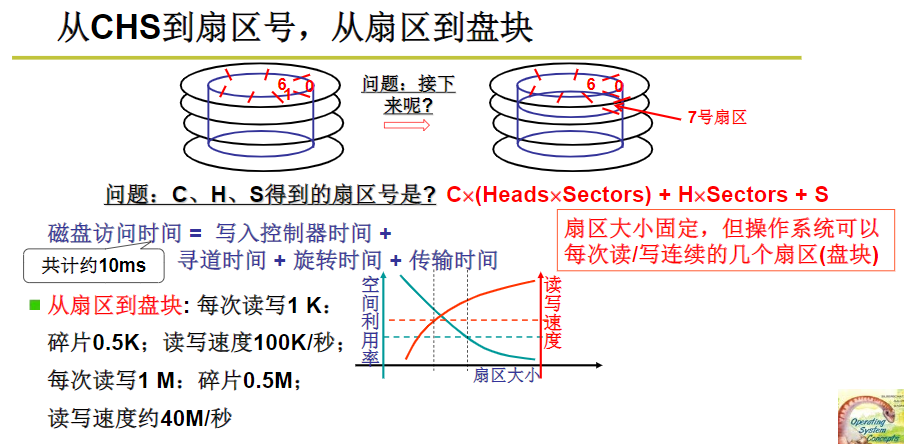

磁盘的IO过程

首先，悬臂移动到特定磁道上。所花费的时间称为 平均寻道（Average Seek Time）

然后，旋转磁盘让磁头定位到具体的扇区(512字节)所花费的时间称为 平均延时(Average Latency)

> 读取数据时磁头进行旋转，此时磁信号转成电信号，写数据时电信号转成磁型号。

随机情况下，平均找到一个几何扇区，我们需要旋转半圈盘面。上面 7200 转的硬盘，那么一秒里面，就可以旋转 240 个半圈。那么，这个平均延时就是：1s / 240 = 4.17ms。因此如果随机在整个硬盘上找一个数据，需要 8-14 ms，即7200 转的硬盘随机的 IO 访问次数为：1s / 8 ms = 125 IOPS 或者 1s / 14ms = 70 IOPS

## 操作系统访问磁盘的过程 

首先，文件系统对磁盘进行分块，
然后，应用程序向磁盘驱动发送需要读取的磁盘块，
接着，磁盘驱动将盘块号计算出柱面（多个磁盘的同一个位置的磁道），磁头，扇区。
最后，操作系统连续读取多个磁盘扇区以提高磁盘的顺序访问速度。

