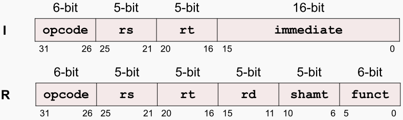
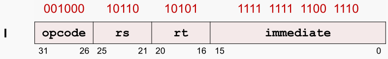

I型指令

> R 型指令只有一个 5-bit 域表示立即数，范围为 0~31
> 常用的立即数远大于这个范围，因此需要新的指令格式
> I 型指令的大部分域与 R 型指令相同

opcode 用于指定指令的操作类型（但没有funct域）
rs Source Register 指定第一个源操作数所在的寄存器编号
rt Target Register 指定用于目的操作数（保存运算结果）的寄存器编号，对于某些指令，指定第二个源操作数所在的寄存器编号

immediate 16-bit 的立即数，可以表示 $2^{16}$ 个不同数值，对于访存指令，如lw rt,imm(rs)通常可以满足访存地址偏移量的需求（ -32768~+32767 ）。对于运算指令，如addi rt,rs,imm，无法满足全部需求，但大多数时候可以满足需求

I 型指令的编码示例

addi $21,$22,-50 # $21=$22+(-50)
查指令编码表得到：opcode = 8，分析指令得到：rs = 22 （源操作数寄存器编号）rt = 21 （目的操作数寄存器编号）immediate = -50 （立即数）

