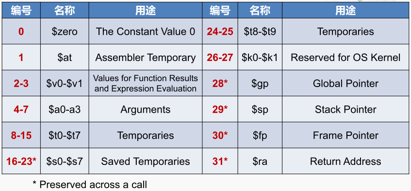

MIPS是精简指令系统（RISC）的代表，由John Hennessy设计。现在MIPS处理器已经不再应用在计算机产品中了，但是在广义的计算设备包括数字电视，游戏机，网络设备等领域仍然有广泛的应用。

> RISC ： Reduced Instruction Set Computer ，精简指令系统计算机
> CISC ： Complex Instruction Set Computer ，复杂指令系统计算机

MIPS全称的含义 是一个流水线不会互锁的微处理器，希望其指令的设计能让微处理器运行的更快，性能更好。所以它主要的关注点是减少指令的类型，并且降低 指令的复杂度，所以在MIPS指令系统当中，指令的总数是很少的。而且每条指令都比较简单。

那MIPS的指令设计要点：
第一，MIPS固定了指令的长度为32个比特，也就说MIPS中的一个WORD，而X86中一个WORD是16位。
第二，MIPS采用了非常简单的寻址模式，相比于X86提供的复杂多样的寻址模式，虽然给编程带来了不变，但是大大简化了CPU访问存储器的控制逻辑。
第三，MIPS指令的数量比较少，每条指令的工作也很简单，基本上一条指令只完成一个操作。
第四，在MIPS指令系统中只允许LOAD和STORE这两种指令访问存储器，而不支持X86指令中这些让算术指令访问存储器的操作。

通用寄存器

通用寄存器总共有32个，每个都是32位编号从0，一直到31，那可以用$符加上编号进行指示，同时每个寄存器还有一个符号的名称，并且约定了一些特定的用途，例如 8号到15号寄存器，又被称为T0 -T7的寄存器，用来保存临时的变量，1号寄存器，它的名称是AT,专门留给汇编器使用。

[[MIPS指令分类]]

[[R型指令]]

[[I型指令]] 

[[分支指令]]

