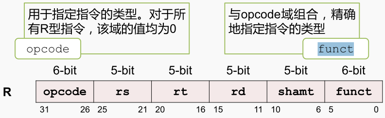
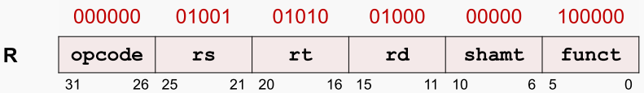

R型指令

R 型指令格式包含 6 个域，2 个 6-bit 域，可表示 0~63 的数，4 个 5-bit 域，可表示 0~31 的数

 R型指令总共包含六个域，其中最高位的opcode域 是六个比特，最低位的funct域也是六个比特， 中间的四个域，均为五个比特。
`opcode`域，指定指令的类型，所有的R型指令均为零，与`funct`域来连用指定指令的类型。 
`RS` Source Register 域，指定第一个源操作数所在的寄存器编号
`rt`Target Register 域指定第二个源操作数所在的寄存器的编号
`rd`Destination Register 域指定目的操作数的寄存器编号，即保存运算结果

5个比特的域可以表示0-31的数， 正好与mips的体系结构中的32个通用寄存器对应，

`shamt`shift amount 域用于指定移位指令进行移位操作的位数。对于非移位指令，这个域被设为0， 

R 型指令的编码示例

`add $8,$9,$10` 

查指令编码表得到：opcode = 0 ，funct = 32 ，shamt = 0 （非移位指令）
根据指令操作数得到：rd = 8 （目的操作数），rs = 9 （第一个源操作数）rt = 10 （第二个源操作数）

将各个域的数值转换成二进制数，填写到对应的位置， 就可以得到这条指令的二进制编码。

