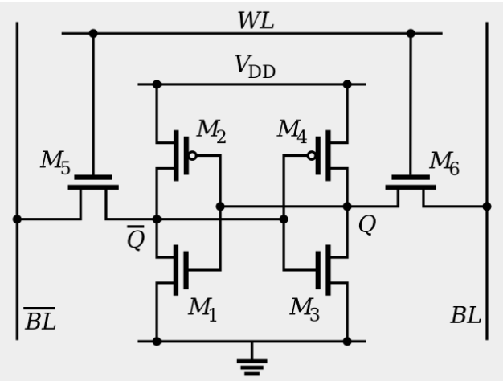

SRAM

SRAM，“静态”存储器，数据只能保存在通电的状态下。一个比特的数据，需要6个晶体管，用m1，m2一直到m6进行标记。包含三个对外的接口信号，其中BL和BL bar 是用于传送读写数据信息的，而wl信号则是用于控制外部是否可以访问这个基本存储单元。**CPU Cache**（CPU 高速缓存，常常简称为“缓存”），用**SRAM**（Static Random-Access Memory，静态随机存取存储器）的芯片。

[[SRAM芯片读写过程]]