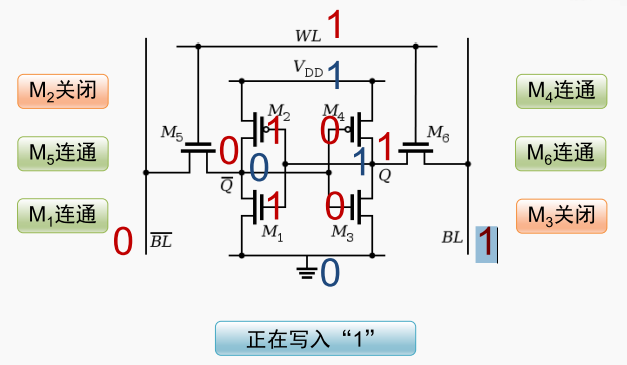
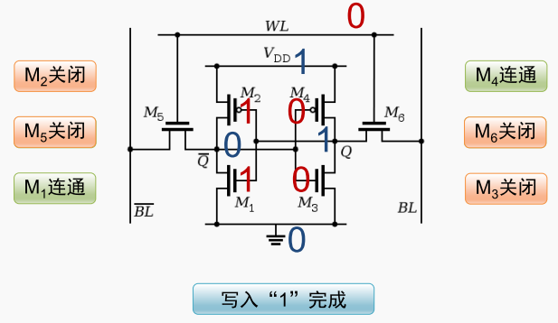
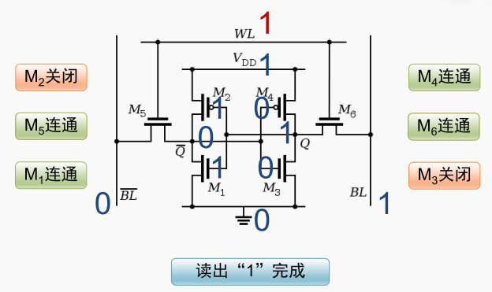

写入数据

首先这个存储单元中连接的电源VDD 和 地 分别代表着一和0， 只要SRAM处于通电状态，这两个信号的值都会保持稳定。如果要写入1，就得将BL的信号的值置为1，而与之相对则需要将BL bar信号置为0，以及把wl信号置为1，一旦wl信号为1那它所连接的M5和M6这两个晶体管的gate端就都为1。 

M6是一个NMOS晶体管，当gate端连接为1 时，应该处于连通状态。 因此BL信号上的值就会通过M6传递进来。

与它相连的M2晶体管的是一个PMOS管，当gate端如果为1，应该处于关闭的状态，所以从电源这连过来的1不会被传导出来。

与它相连的M1晶体管的是一个NMOS管，当gate端连接为一时，应该处于连通状态。

而M1的gate端和M2的gate端连接的是同一个信号， 所以现在也是1，M1是一个NMOS，所以它处于连通状。所以这根信号上的值就应该是0

根信号线同时连接到了M5的这跟晶体管，而M5的gate端也是由WL信号控制的， 所以M5也是处于联通状态，它会将BL bar信号的0传导进来， 

M4是一个PMOS管，当gate端为0的时候就处于连通状态，来自电源的这个1会被传导进来，与此同时M3的gate端也是0，那这根NMOS晶体管就会处于关闭状态。 所以这根信号与地是不连通的，那这样从M3和M4的控制来看，这跟信号也应该是1。

那这样由外部的BL和BL bar输入的信号就驱动了这个SRAM存储单元的晶体管达到了一个稳定的状态。 那因为晶体管的工作速度很快，所以这个SRAM的写入的过程也非常快，那当这几个晶体管状态达到稳定之后我们就可以结束这次写的过程了。 

现在我们可以将WL信号由1变为0，从而将M5和M6这两个晶体管关闭， 然后就可以撤销BL和BL bar上的信号了。 
那在外部的信号撤销之后，那因为M5和M6这两个晶体管都关闭了，所以并不是由外部的BL信驱动M2和M1这两个晶体管的gate端， 
但是我们注意在刚才写入的过程中，因为M4晶体管处于连通状态， 所以电源所传导的这个1会始终驱动这根信号，
保持M2和M1的gate端为1， 而只要M2和M1的gate端为1，那么由D传过来的这个0就会保持稳定，
而这个0又会反过来驱动M4和M3保持刚才的状态，从而让这个1也保持稳定，那么在这四个晶体管的相互作用下，
那这个SRAM单元就稳定地保持住了刚才写入的这个数据1。 

那现在只要WL信号保持为0，这个SRAM 存储单元当中就会始终存储的这个数据1， 当然前提是要保持通电的状态。 
如果断电，电源的这个1消失了，那SRAM当中保存的这个数据也就会丢失。 

SRAM的读出过程。 
把WL信号置为1， 那这样M5和M6这两个晶体管都会处于连通的状态， 而此时外部并不驱动BL和BL bar这两根信号，因此它们将会分别通过M5和M6这两个晶体管被这个SRAM的存储单元所驱动。BL bar的信号将会被驱动为0，而BL的信号将会被驱动为1。 这样外部在接受到这两根信号之后就可以判断出读出的是一个数据1。 

#ignore