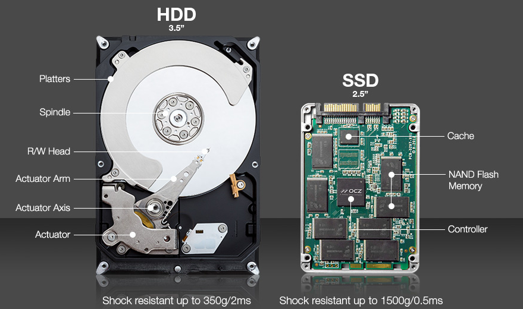
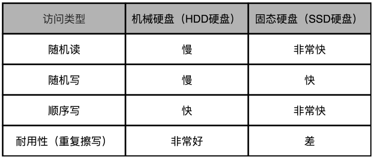

SSD 与 HDD 对比

1. SSD 不需要寻道过程因此相对机械硬盘可以提供更快的的随机读写。
2. 机械硬盘可以直接通过**覆写**（Overwrite）完成写入，但SSD每块都由擦除次数的限制。

> SSD 硬盘在数据写入前需要先去擦除（Erase），然后再写入，但读取和写入的基本单位是**页**（Page）而SSD 的擦除单位为**块**。
> SLC 的芯片，可以擦除的次数大概在 10 万次，MLC 就在 1 万次左右，而 TLC 和 QLC 就只在几千次了。
