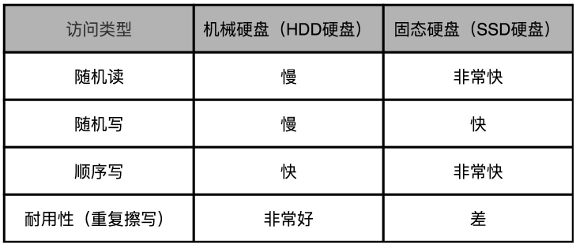

固态硬盘（Solid State Drives），用固态电子存储芯片阵列而制成的硬盘，由控制单元和存储单元（FLASH芯片、DRAM芯片）组成。存储介质分为闪存（FLASH芯片）和DRAM 两种。 常见的闪存包括SLC、MLC及TLC。

控制器主要功能包括：自动信号处理，耗损平衡，错误校正码(ECC)，坏块管理、垃圾回收算法、与主机设备(如电脑) 通信，以及执行数据加密等任务。目前主流的控制器有Marvell、SandForce、Samsung、Indilinx等。

## 存储介质：SLC、MLC、TLC 和 QLC

**MLC**（Multi-Level Cell）、**TLC**（Triple-Level Cell）以及**QLC**（Quad-Level Cell）则能在一个电容里面存下 2 个、3 个乃至 4 个比特。

电压计：用于识别不同的电压，使用不同的电压表示不同数字

缺点：电压的识别效率相对较低

## 硬盘硬件构造

SSD 硬盘由很多个裸片（Die）叠在一起

一张裸片上可以放多个**平面**（Plane），容量 GB。

一个平面上面，会划分成很多个块（Block），容量 KB 到几 MB 。

一个块里面，会区分很多个页（Page），容量 4KB。

[[SSD磁盘IO过程]]

[[SSD硬盘的优化方案]]

## SSD 与 HDD 对比

1. SSD 不需要寻道过程因此相对机械硬盘可以提供更快的的随机读写。
2. 机械硬盘可以直接通过**覆写**（Overwrite）完成写入，但SSD每块都由擦除次数的限制。

> SSD 硬盘在数据写入前需要先去擦除（Erase），然后再写入，但读取和写入的基本单位是**页**（Page）而SSD 的擦除单位为**块**。
> SLC 的芯片，可以擦除的次数大概在 10 万次，MLC 就在 1 万次左右，而 TLC 和 QLC 就只在几千次了。

