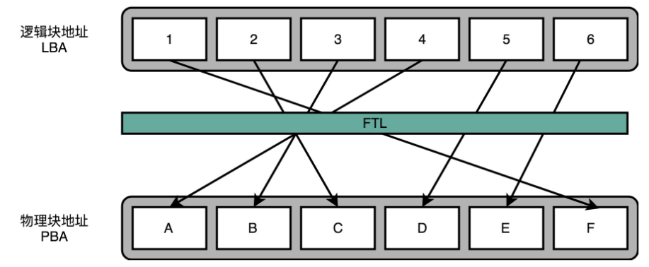

SSD磁盘数据读写是按页（4k），而磁盘的擦写则是按照块。因此在文件读写的过程中只有一个块完全被标记为删除时才会被擦写，但如果在后续的磁盘写入过程中发现没有足够的空间则会进行一次磁盘整理的操作，将磁盘整理为连续的只包含有效数据的块。

>找一个红色空洞最多的块，把里面的绿色数据，挪到另一个块里面去，然后把整个块擦除，变成白色可以重新写入数据。

> 白色表示空白，绿色有效数据，红色已经删除但未被擦除的数据

由于SSD硬盘的磁盘整理需要额外的磁盘空间，因此 SSD 硬盘的生产厂商会为每个磁盘都预留了一部分空间。通常预留 7%-15% 左右。

磨损均衡、TRIM 和写入放大效应

**磨损均衡**（Wear-Leveling）: 让 SSD 硬盘各个块的擦除次数，均匀分摊到各个块上。

FTL **闪存转换层**：存放了**逻辑块地址**（Logical Block Address，简称 LBA）到**物理块地址**（Physical Block Address，简称 PBA）的映射，且记录了每个物理块被擦写的次数。操作系统使用逻辑地址访问 FTL，然后FTL将逻辑地址转换为物理地址块。

TRIM 指令：文件删除时通知FTL的指令。

> 在操作系统中删除文件是，只在文件系统中清理掉对应的 inode  元数据信息。SSD硬盘不支持覆写，因此需要发送而外的指令通知SSD删除具体的块。
