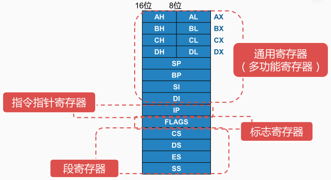
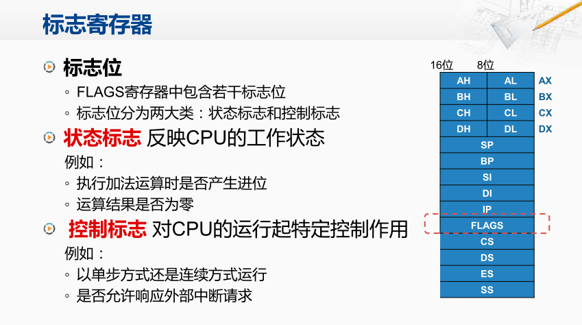
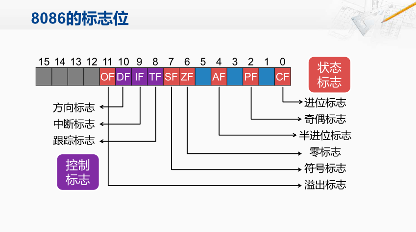
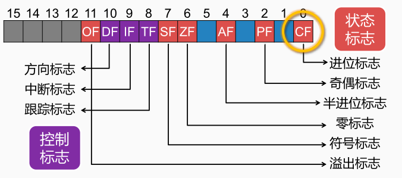
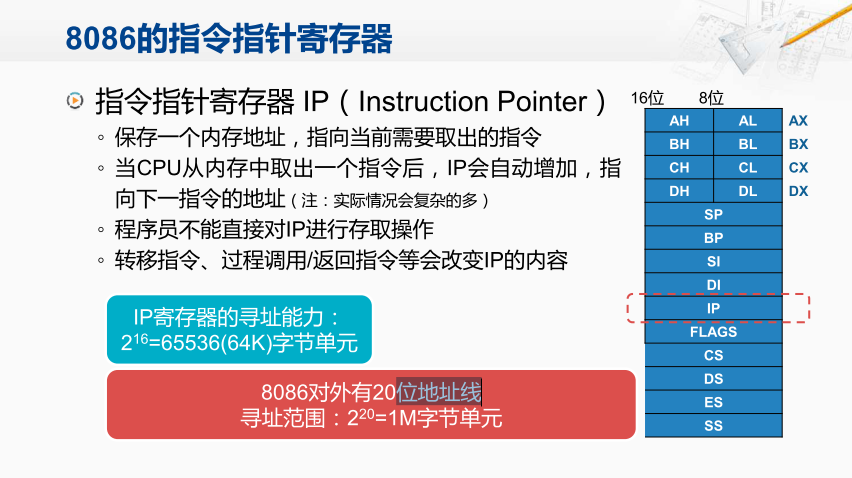
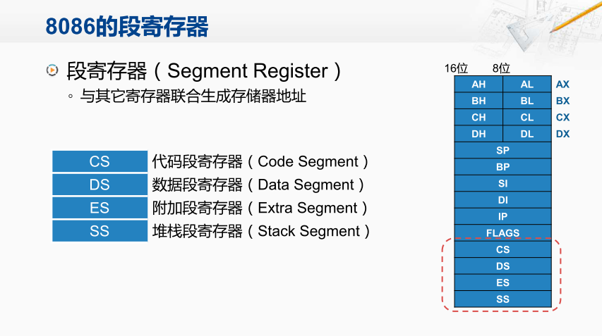
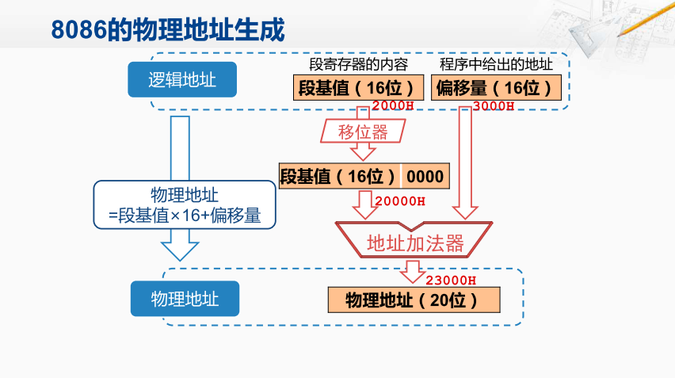
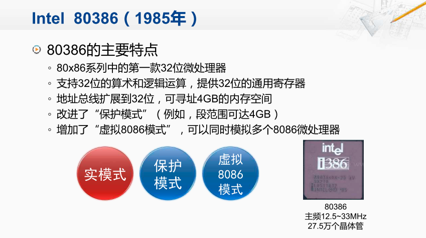
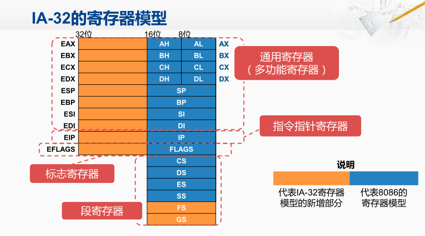
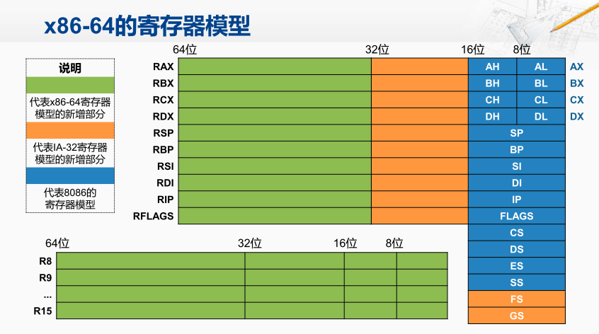

寄存器

8086体系结构所规定的寄存器都是16位宽的，主要可分为这几类：通用寄存器、指令指针寄存器、标志寄存器，还有段寄存器。

通用寄存器

对于8086而言用于存储数据的通用寄存器， 主要包含四个16位的寄存器：AX、BX、CX和DX(16位寄存器还可以被分为两个8位的寄存器）。

指针和变地寄存器：SP、BP、SI、DI。SP、BP用于堆栈操作，SI和DI用于串操作。也可当做通用寄存器使用

标志寄存器

标志寄存器FLAGS主要可以分为两大类，一类称为状态标志，反映的是CPU的工作状态。另一大类称为控制标志，对CPU的运行起到特定的控制的作用。

8086的标志位

8086的标志寄存器也是16位的，下图中标为红色的都是状态标志，标为紫色的这三个是控制标志。例如加法的进位标志。当CPU执行完一条加法指令， 而这次加法运算的结果产生了一个进位，那CPU内部除了将加法的运算结果保存到对应的寄存器之外， 还同时会将这个CF标志置为1

标志寄存器

标志寄存器当中有一个ZF标志位，如果DEC指令的运算结果为0， 就会将ZF标志位置为1，代表这次运算的结果为0， 否则就会把ZF标志位置为0。 从模型机上来看，当执行刚才那条JNZ的转移指令时， CPU会来检查标志寄存器当中的ZF位，从而决定如何改变下一条指令的地址。 根据刚才那个程序所需要的功能， 如果DEC指令运算的结果为0则不转移， 而如果运算的结果不为0，应该将下一条 指令的地址改为LOOP1那个标号所指向的指令的地址。 

指令指针寄存器

在模型机上，CPU要去取下一条指令之前， 都会先从PC寄存器当中，取出下一条指令的地址，将这个地址发到存储器中，才能取回下一条指令的编码。那在8086当中，这个寄存器称为IP寄存器。IP是指令指针的缩写。

因为IP寄存器是16位宽的，所以它能够指向的内存单元的数量是2的16次方即64K个字节单元。由于64k个字节单元仍然不能满足大多数程序的需求，因此，8086通个20位地址总线连接1兆字节的内存。8086通过4位的段寄存器和其他16位的寄存器联合生成存储器地址

8086的段寄存器

CS是代码段寄存器，DS是数据段寄存器。ES是附加段寄存器，SS是堆栈段寄存器。

逻辑地址转化为物理地址

1M字节的存储空间分成许多逻辑段，每段最长64k字节，可以用16位地址寻址，编程时使用逻辑地址，不需要知道代码或数据在存储器中的具体物理位置，从而简化存储资源的管理。

80386

80386是x86系列当中第一款32位的微处理器，其运算部件可以支持32位数据的运算与32位的通用寄存器，也可以产生32位的地址，从而可以指向4G字节的内存空间。

32位x86的体系结构也被称为IA-32，它所提供的32位寄存器是在8086，16位寄存器的基础上扩展而来的。AX寄存器在为它增加了16位之后就变成了32位的EAX寄存器。在指令中如果使用EAX， 就是指这个32位的寄存器，但与此同时，指令中还可以继续使用AX来指定其中的低16位。同样也可以继续使用AH和AL这两个8位的寄存器编号，那这样IA-32中就有了8个32位的通用寄存器，还有一个32位的标志寄存器。指令指针寄存器也扩展到了32位，用这个寄存器就可以指向2的32次方，也就是4G字节的内存空间。80386额外增加了2个段寄存器

x86-64

英特尔提出的IA-64体系架构，由于和之前的x86体系结构并不兼容等原因导致新的结构并未获得成功。与此同时AMD提出了与原先兼容的64位的x86的方案从而在64位的时代占据了先机。这个方案有很多不同的名字， 比如说AMD64，Intel64，通常我们更多地把它称为x86-64。

x86-64的寄存器模型

x86-64的寄存器模型则是在IA-32的32位寄存器模型的基础上进行了扩展。那在原先32位的EAX寄存器的基础上再增加32位，形成了64位的RAX寄存器。而指令指针寄存器也被扩展到了64位，因此理论上就可以访问2的64次方个字节这么大的内存空间。在x86-64当中，另外还新增了8个64位的通用寄存器，这8个新增的寄存器的名称依次为R8，R9，一直到R15。因为之前我们就已经有了8个通用寄存器为从R0到R7。

