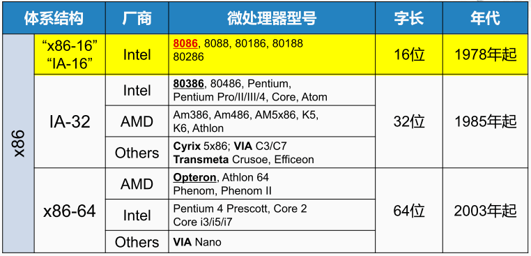
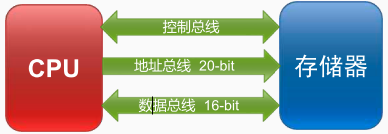
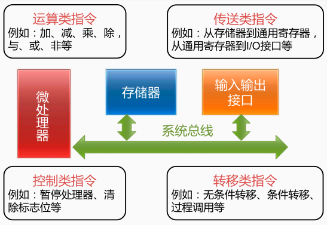

体系结构

X86是商业上最为成功，影响力最大的一种体系结构。以下是X86体系结构当中，具有代表性的一些微处理器的型号。主要分成了16位、32位和64位三大类。

> 因为运算当中所需要的数据，一般会放在<u>通用寄存器</u>中。所以通用寄存器的位宽通常和**运算单元**的位宽是相同的。而运算单元产生的数据又经常会用做访问存储器的地址。所以<u>CPU访存地址</u>的宽度，也常常和运算单元的位宽相同。
>
> 地址总线：一个cpu的N根地址总线，则可以说这个CPU的地址总线宽度为N。这样cpu最多可以寻址2的N次方个内存单元。

8086

8086是一款16位的CPU，即CPU当中的运算部件可以支持16位数据的运算，且内部的通用寄存器也是16位的。但是它连接存储器的<u>地址线的宽度</u>却是20位的（需要大容量的存储器导致）。

x86指令种类可以分为运算指令、传送指令、转移指令、控制指令等

运算指令，用于加、减、乘、除或与、或、非。

传送指令，用于把数据从<u>存储器</u>送到通用寄存器，或者从通用寄存器送到I/O接口等。

转移指令，无条件转移、条件转移、过程调用等。

控制指令，暂停处理器、清除标志位等。

[[x86指令寄存器]]

[[传送指令]]

[[控制指令]]

[[转移指令]]

[[运算指令]]

[[加法程序]]

#ignore