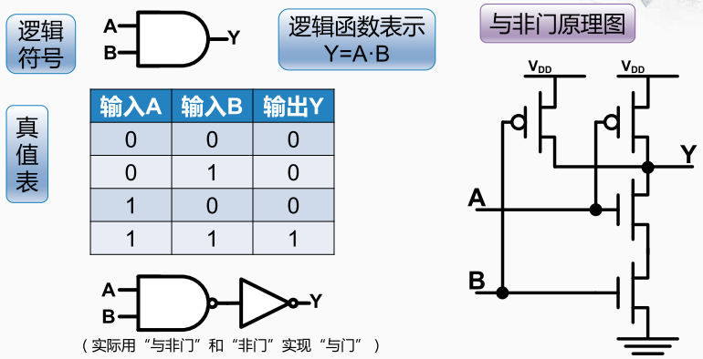
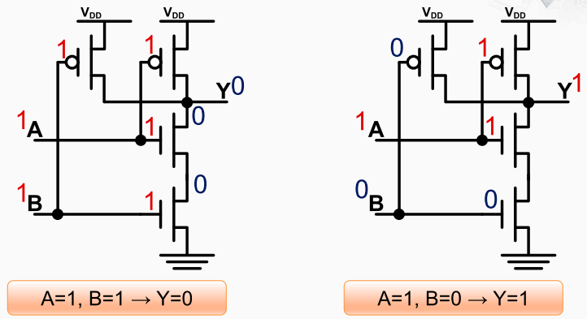

与门

在实现中与非门比与门的实现更为简单，因此与门长表示为与非门的非门。

> 与非门的输出结果于与门正好相反， 即只有两个输入均为`1`时输出为`0`，其它时候输出都为`1`。

与非门

假设a等于1，b等于1， 对于与非门来说，这时候的输出结果应该是0。

a和b都为1时，b所连接的PMOS晶体管的gate端为1， 所以这个晶体管是关闭的。b连接的NMOS晶体管的gate端是1，所以它是导通的，那么它就会把0传导出来， 但这个0还需要经过有输入a控制的一个晶体管才能传导到y。

a连接的NMOS晶体管的gate端为1，所以这个晶体管也是导通的，因此由b晶体管传到过来的`0` 会被传递到y。与此同时 a连接的PMOS晶体管的gate端为1时，所以这个晶体管是关闭的， 因此信号y与电源之间并联的两个晶体管都处于关闭状态， 而与地之间串联的两个晶体管都处于导通状态。 所以y的值就是`0`。 

