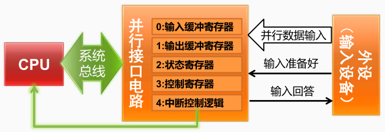
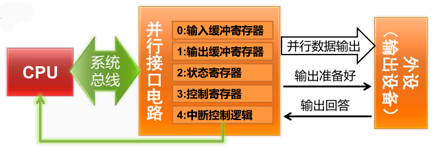

## 数据输入过程

1. 系统初始化时， CPU 执行指令，将控制字写入接口的“控制寄存器”，设置接口的工作模式
2. 外设将数据发到“并行数据输入”信号，并将“输入准备好”信号置为有效
3. 接口发现“输入准备好”信号有效后，从“并行数据输入”信号接收数据，放入“输入缓冲寄存器”，并将“输入回答”信号置为有效，阻止外设输入新数据
4. 接口通过“中断控制逻辑”向 CPU 发出中断请求信号，并将“状态寄存器” 中的状态位“输入缓冲满”置为有效
5. CPU 收到中断请求后，进入中断服务程序，并从“输入缓冲寄存器”中读出数据
6. 接口将“输入回答”信号置为无效，等待外设输入新数据

## 数据输出过程

1. CPU 执行指令，将控制字写入接口的“控制寄存器”，从而设置接口的工作模式
2. CPU 执行指令，将数据写到接口的“输出缓冲寄存器”
3. 接口将数据发到“并行数据输出”信号，并将“输出准备好”信号置为有效（亦可由 CPU 写控制字将该信号置为有效）
4. 外设发现“输出准备好”信号有效后，从“并行数据输出”信号接收数据，并将“输出回答”信号置为有效
5. 接口发现“输出回答”信号有效后，通过“中断控制逻辑”向 CPU 发出中断请求信号，并将“状态寄存器”中的状态位“输出缓冲空”置为有效
6. CPU 收到中断请求后，进入中断服务程序，执行指令从“状态寄存器”中读出状态字，发现“输出缓冲空”，因此开始下一个输出过程，继续输出新数据

[[中断检测与处理]]

[[8086的中断处理]]