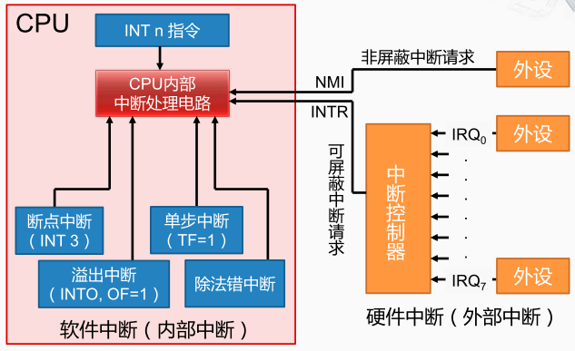
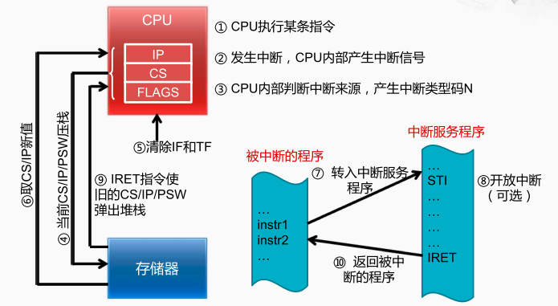

CPU内部是如何检测中断的

中断信号可以来自于软件比如除法错误，也可以来自于外部比如键盘、网络等，CPU检测到了中断请求信号就会进行处理。 

中断处理的过程：
第一步，CPU会关闭中断响应，不再接受后面其他的外部中断请求。  
第二步，将发生中断处的这个指令的地址保存到栈中，以便于处理完中断后可以正确地返回当前的程序继续执行。 
第三步，CPU依据中断的来源确定中断类型号，从而能够找到相应的中断服务程序的入口地址。 
第四步，保存现场将中断服务程序中可能会改变的寄存器先压栈。
第五步，就是执行这个中断服务程序的主体内容。 
第六步，恢复现场并且返回主程序继续运行。 从栈顶弹出三个字，分别送到IP、CS和FLAGS寄存器中。 

> 外部中断，也称硬件中断，由 CPU 外部的中断请求信号启动的中断。x86 CPU 为外部中断提供两个引脚，NMI ：非屏蔽中断，INTR ：可屏蔽中断
