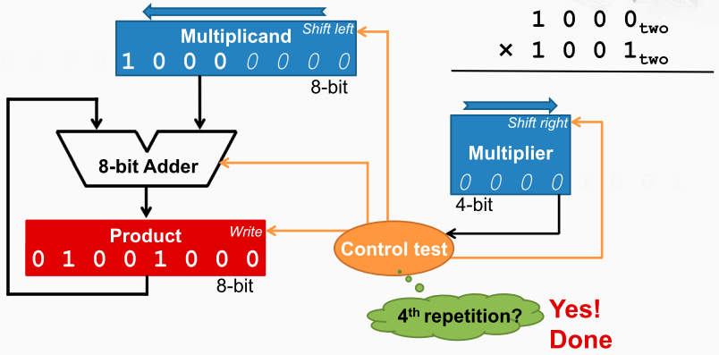

乘法器的实现

在4位乘法器中需要使用8位寄存器保存被乘数，且寄存器带有左移的功能。 它有一个左移的控制信号输入，当外部的控制逻辑将这个信号为有效时，
在下一个时钟上升沿到来的时候，被乘数寄存器当中的内容就会向左移动一位。

4位寄存器保存乘数，且寄存器具有右移功能，乘数寄存器的最低位被连到了控制逻辑， 也就说控制逻辑可以观察当前乘数寄存器的最低位，
并据此来生成相关的控制信号， 这些控制信号就包括是否要让加法器进行加法运算，以及是否要让乘积寄存器保存当前的运算结果。

8位的寄存器保存乘积，用来保存运算的结果。 被乘数寄存器当中的内容和乘积寄存器当中的内容需要进行加法运算，

以及一个8位的加法器，将被乘数寄存器当中的内容和乘积寄存器当中的内容进行相加，并将结果再送到乘积寄存器中。

