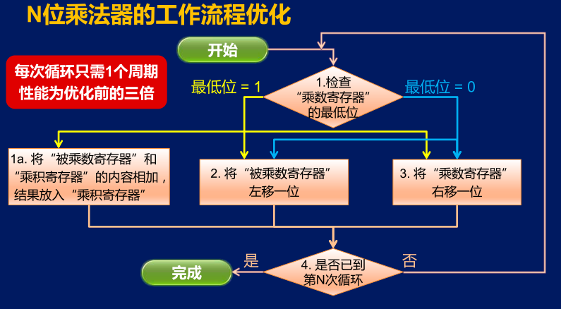

乘法器的优化

分析现有的乘法器工作流程，可以发现第1a步执行这个加法 我们需要一个时钟周期，第2步的左移又需要一个时钟周期第3步的右移还需要一个时钟周期。 
因此这个乘法器工作时，每执行一轮，都需要3个时钟周期 那如果是一个32位的乘法器，那就大约需要100个时钟周期。 
由于在实际的实现中这些步骤并不需要串行执行，因此可以让这些加法和位移操作并行执行。

寄存器的内容只会在时钟上升沿来临的时候发生变化 而在其他时候，无论输入端如何变化，寄存器的内容都不会发生变化。 

假设现在时钟上升沿还没有来临，

那“被乘数寄存器”的输出就是它当前所保存的内容 00001000，这八位信号会被送到加法器的输入端。

而加法器的另一个输入端连接的是“乘积寄存器”的输出端，因此，现在的值是全0。 

而当前“乘数寄存器”的最低位为1，所以控制逻辑会据此产生相关的控制信号，包括给出加法信号让加法器进行加法运算。 

给出乘积寄存器的写输入信号，但是现在时钟上升沿还没有来，所以“乘积寄存器”其实什么也不会做。 

还可以给出“被乘数寄存器”的移位信号以及“乘数寄存器”的移位信号。 

因此当时钟上升沿到来的时候，寄存器就会根据输入改变其内容 ，这3个寄存器会同时发生变化。 
“乘积寄存器”会将输入端的数保存起来，“被乘数寄存器”会向左移动一位，“乘数寄存器“会向右移动一位。

由于寄存器在时钟上升沿之后很短的一个时间， 会将新的容就传送到输出端。 
因此我们可以注意到，”被乘数寄存器“的内容现在已经改变，且很快他的输出也会变成00010000，并传递到加法器。 
但是可以放心的是，即使这个信号经过了加法器，并产生了新的运算结果这个运算结果也不会改变”乘积寄存器“的内容。 
因为等这个信号传递到了”乘积寄存器“的输入端时已经过去了一段时间，
这时候”乘积寄存器“对输入端的采样工作已经完成 其输入端信号的改变不会影响这个寄存器的内容了。 
这样就在同一个时刻完成了所有的加法和移位的操作。 