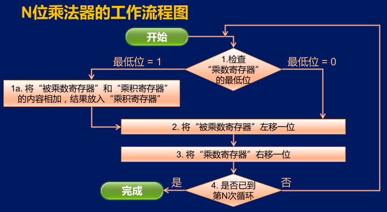

N位乘法器的工作流程图

第1步，检查“乘数寄存器”的最低位如果这个最低位是1，那么就将“被乘数寄存器”和 “乘积寄存器”的内容相加，运算结果还放入“乘积寄存器”当中。 

第2步，将“被乘数寄存器"的内容左移 一位

第1a步，如果乘数寄存器的最低位等于`1`则将“被乘数寄存器”和“乘积寄存器”的内容相加，结果放入“乘积寄存器”，否则跳过

第3步，是将”乘数寄存器“的内容右移一位 

第4步，检查是否已经到了第N次循环 如果不是，则回到第1步，再检查”乘数寄存器“的最低位。如此往复循环，直到检查到是第N次循环就结束乘法运算。 
且运算结果就放在”乘积寄存器“当中。 

