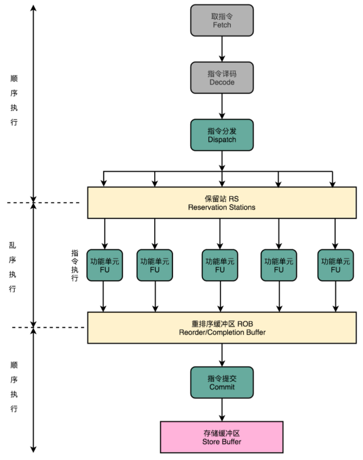

**乱序执行**

乱序执行，在CPU指令执行层面乱序执行。在执行完成之后会按照指令的分发顺序重新排序。
> 即内部是“乱序”的，但是在外部看起来，仍然是井井有条地顺序执行。

1. 在取指令和指令译码与流水线架构的 CPU一致，顺序地进行取指令和指令译码的工作。

2. 在指令译码完成之后，CPU 将指令分发保留站（Reservation Stations）。

3. 当指令获取到所依赖的数据后，再转交到 ALU执行。

4. 指令执行的阶段完成之后，再把结果再存放到重排序缓冲区（Re-Order Buffer，ROB）然后对计算结果按CPU取指顺序排序。

5. 最后将实际的指令的计算结果数据，写入存储缓冲区（Store Buffer），最终才会写入到高速缓存和内存里。

> 只有 CPU 内部指令的执行层面，可能是“乱序”的