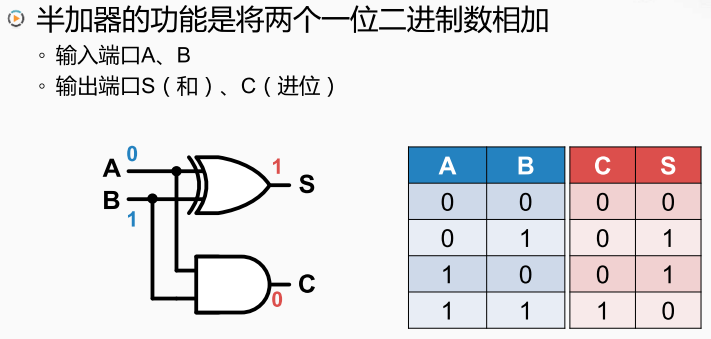
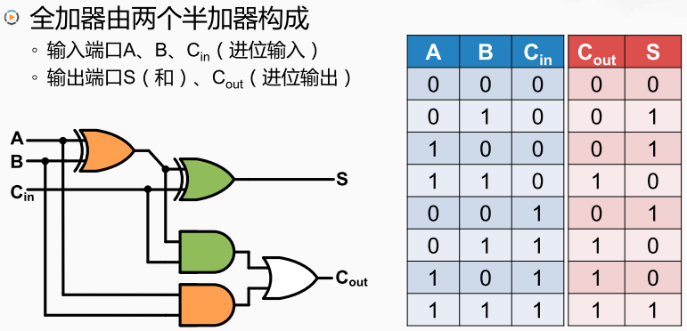
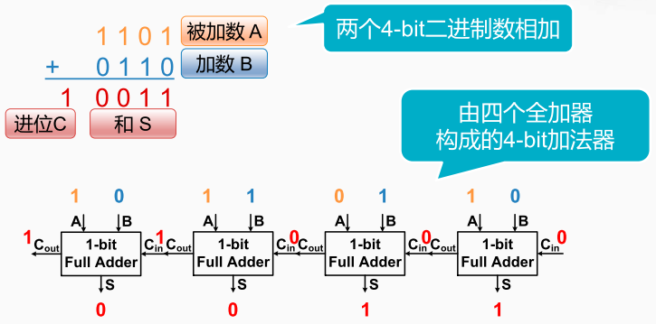
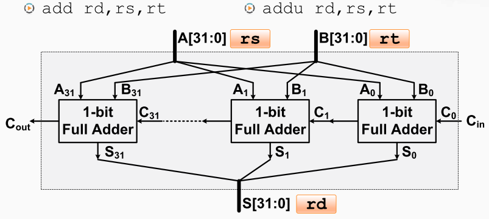
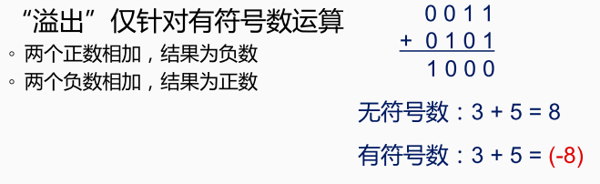

二进制加法电路

半加器

半加器的功能是将两个1位的二进制数相加。由一个异或门计算出和和与门计算出进位组成。两个输入端口 A和B，分别代表要相加的两个一位二进制数。 两个输出端口S和C，S表示这两个一位二进制数 

相加对应产生的（和），而C则是它们产生的进位； 有进位就是1，没有进位就是0 。

 

全加器

全加器，由两个半加器构成的。这两个绿色的异或门和与门就是一个半加器，而这两个橙色的异或门和与门是另一个半加器，最后再添加一个或门就构成了全加器。 

全加器包含三个输入两个原操作数A和B以及一个进位输入C in。两个输出运算结果S和进位输出C out。 

用全加器构成一个4比特的加法器 

将四个全加器串联起来，前一个全加器的进位输出连到后一个全加器的进位输入。

A和B各包含四个二进制位分别用橙色和蓝色表示。 在运算时，需要将A对应的二进制位连到这四个全加器的A输入端口，而将B对应的四个二进制位连到这四个全加器的B端口。 整个加法器的进位C in输入为0 所以最右边加法器的输出 S为1，C out则为0。 从而可以从右到左推导出所有全加器的输出。那么将32个全加器串联起来就构建出一个32为的加法器。整个加法器的进位输入连接到了最低位的全加器。 而最高位全加器的进位输出作为整个加法器的进位输出。 

指令分析

指令 `add rd,rs,rt` 或 `addu rd,rs,rt` 只需要将`rs`所指向的寄存器和`rt`所指向的寄存器的内容分贝连接到A端口和B端口。并将`S`送到`rd`所指向的寄存器。就可以完成对应的加法运算。

>add 与 addu 的区别就在于对有符号运算溢出的处理不同。 溢出是指有符号数字的运算结果超出了有限二进制位能表示的范围。

