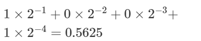
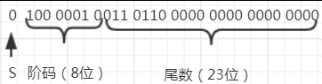

假设存在二进制的浮点数 0.1001， 把小数点后的每一位，都表示对应的 2 的 -N 次方。则：

若浮点数x的754标准存储格式为（41360000）16，求其浮点数的十进制数值。将16进制数展开后，可得二进制数格式为

指数e=阶码-127=10000010-01111111=00000011=（3）10

包括隐藏位1的尾数1.f=1.011 0110 0000 0000 0000 0000=1.011011

> 小数部分的二进制转十进制，乘以2的负次方。从小数点后开始，依次乘以2的负一次方，2的负二次方，2的负三次方等然后相加。

于是:
$x=(-1)^S * 1.f * 2^e= + (1.011011) * 2^3 = 1011.011=(11.375)_{10}$
