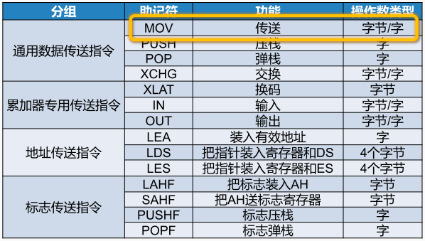
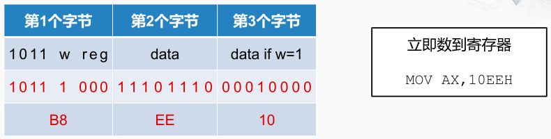
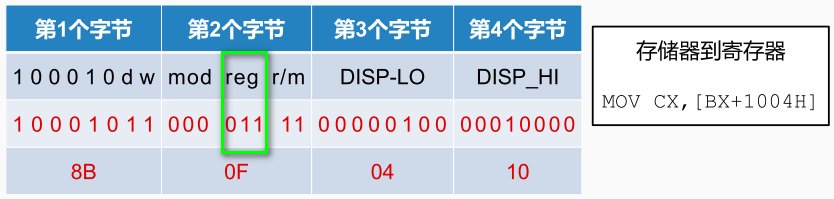

常见传送指令如下：

MOV 指令： MOV DST, SRC。说明： DST 表示目的操作数， SRC 表示源操作数。 MOV 指令把一个操作数从源传送至目的，源操作数保持不变

MOV 指令和寻址方式的示例，x86提供了非常丰富的访问存储器的方法

* 直接给出操作数：`MOV EBX, 40` CPU在从存储器取址的时候就会将**40**作为指令编码的一部分取回来，然后就可以直接送到EBX寄存器中。

* 给出存放操作数的寄存器名称：`MOV AL, BL` 将BL寄存器的内容传送到AL寄存器中

* 给出存放操作数的存储器地址：`MOV ECX, [1000H]` 将1000H所指向的存储器单元中的内容取出，传送到ECX寄存器中

* 给出存放“存放操作数的存储器地址”的寄存器名称：`MOV [DI], AX` 存储器的地址存放在DI寄存器中。

  > CPU需要先从DI寄存器当中取出一个数，把这个数作为访问存储器的地址，再从AX当中取出一个数，作为访问存储器的 数据，再执行写存储器的操作。

* 给出“存放操作数的存储器地址”的计算方法：`MOV WORD PTR[BX + SI * 2 + 200H], 01H`

  > WORD PTR 表示内存地址指向的是长度为1个字的内存单元，也就是两个字节。
  >
  > 存储器的地址 = CPU要从SI寄存器当中取出的数 * 2 + BX寄存器当中取出的数 +  200H

MOV 指令编码示例，第一行是字节的含义，第二行是具体的编码。

指令：`MOV AX,10EEH` CPU取回这条指令编码时就知道需要将后面这两个字节的内容写入到AX这个寄存器当中

第2个字节和第3个字节就是这条指令当中的立即数10EE。

第1个字节的最后3个比特是指定了寄存器的编号，000代表是AX，

第1个字节的前4个比特1011是MOV指令。

指令：`MOV CX,[BX+1004H]` 从存储器 ->  寄存器的传送，而存储器的地址是由BX寄存器的内容和立即数1004H相加得到的。BX寄存器的机器编码为011

x86指令系统是一种变长的指令，可以根据需要设定指令编码的长度，这样就比较灵活。但是从另一个方面来看，这对CPU取指令的操作会带来很多的麻烦。因为CPU在取到这条指令之前， 它无法判断这条指令究竟由几个字节组成，取得少了，那指令编码不全，无法执行； 取得太多，又会浪费时间，还会多占用CPU内部的空间。
