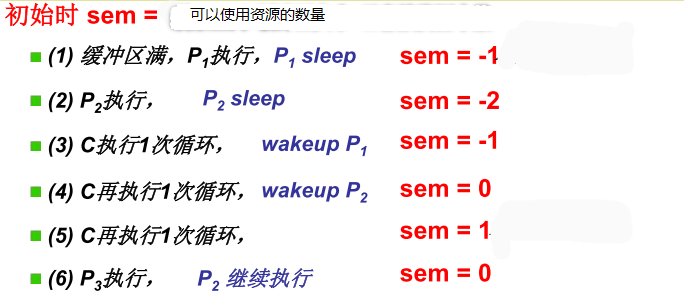
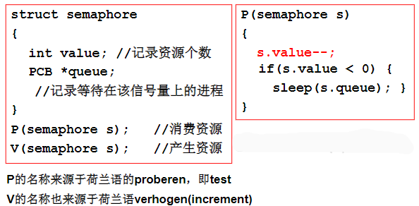
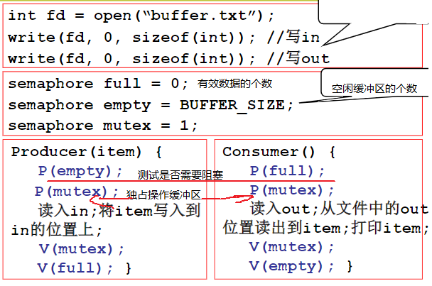

信号量: 1965年，由荷兰学者Dijkstra提出的一种特殊整型变量，量用来记录，信号用来sleep和wakeup



> sem 负数表示处于等待的进程数量。对生产者而言可使用的资源是空闲缓冲区的个数，对消费者而言是缓冲区的有效数据的个数。



```c
C(semaphore s) 
{
    s.value++;
    if(s.value <= 0) 
    {
        wakeup(s.queue);
    }
}
```

> 信号量的值增1和唤醒一个进程同样应当保持原子性。



[[睡眠与唤醒]]