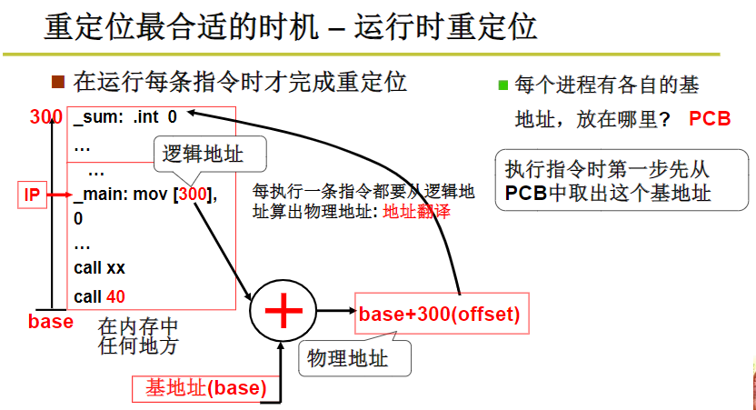
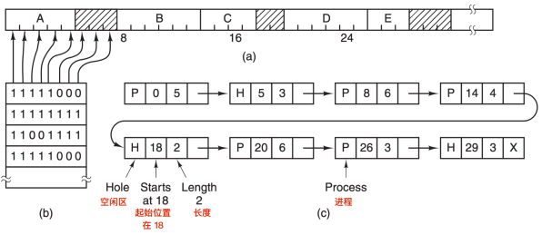

## 存储器的抽象：地址空间
地址空间（the address space）：可以用来寻址内存的地址集。

动态重定位（dynamic relocation）： 将地址拆分为基址和变址，使用基址寄存器（basic register）和变址寄存器（limit register）存储数据内存的起始位置和应用程序的长度。

虚拟内存(virtual memory)：由虚拟地址组成的空间，程序生成的逻辑地址加上段基值形成虚拟地址。虚拟地址通过CPU中的MMU(Memory Management Unit) 内存管理单元将虚拟地址映射为物理内存地址。 

> 物理内存空间划分位多个称为页框(page frames)的物理单元。

空闲内存管理

监控内存使用的方式有两种：位图、空闲列表。

- 位图(bitmap)：首先将内存划分为固定大小的分配单元，每个分配单元对应于位图中的一位，0表示空闲，1表示占用。

- 空闲列表(free lists)：维护一个记录已分配内存段和空闲内存段的链表，结点包含进程或者是两个进程的空闲区域。链表中的每一项都可以代表一个空闲区(H)或者是进程(P)的起始标志，长度和下一个链表项的位置。

[[内存管理机制]]

[[页表]]

[[内存交换]]
