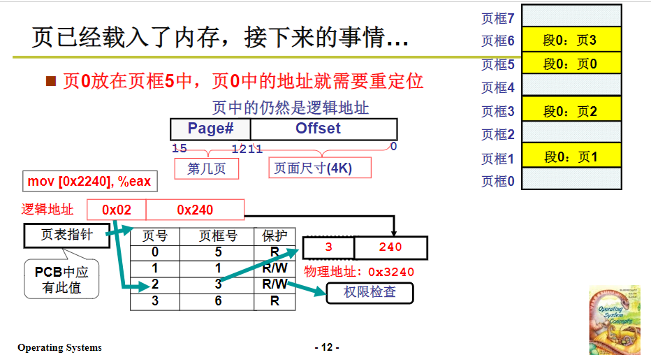
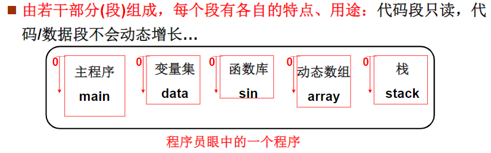
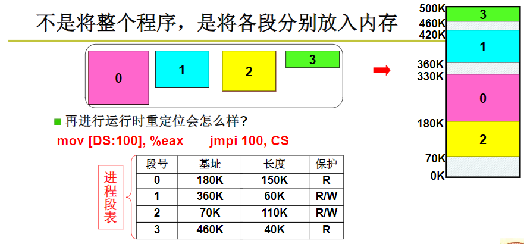
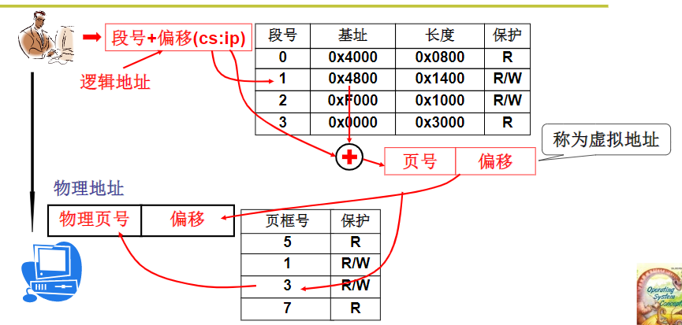

## 页式管理

把主存以比块更小的页作为分配单元，然后通过页表对应逻辑地址和物理地址。

> 16进制的 2240  右移3位 等于 2， 4k =2^12 因此计算在第几页时可以通过右移3位。

## 段式管理

将程序按逻辑信息分成不同的段，如主程序段、变量集、函数库、动态数组、栈

段表LDT 存放在进程的PCB中

在 Linux 下，分页通常只设置成 4KB， 可以通过命令`$ getconf PAGE_SIZE` 

## 段页式管理

首先将内存按分段式管理分为多个段，然后每个段又对应到物理内存的页，从而实现对程序员而言内存是分段的，对物理内存而言是分页的。

程序生成的逻辑地址+段偏移 = 虚拟地址。

虚拟地址通过计算推导出虚拟页号，然后通过虚拟页号找到物理内存的页框号

在物理内存的页框号中进行偏移得到具体的物理地址。

