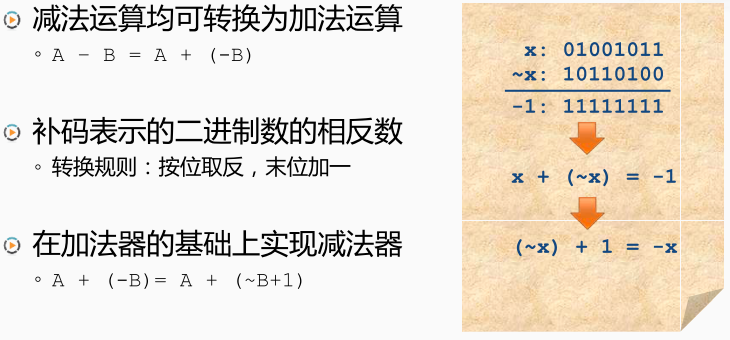
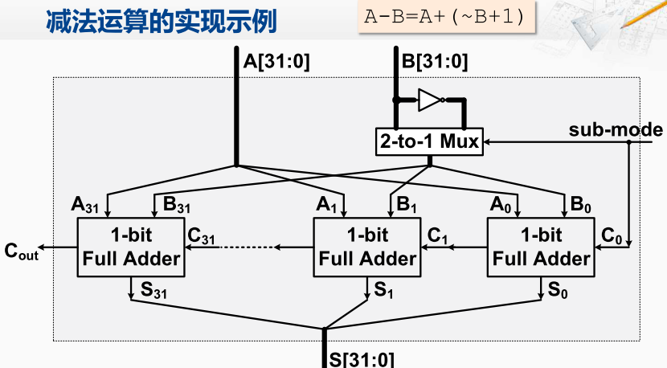

减法运算

其实减法是可以转换为加法运算。**计算机当中使用补码来保存二进制数**

> 补码按位取反，末位加一

B 转负B的过程

例如有一个数X，那么所谓按位取反，就是将X中的每一位由0变成1，由1变成0，那么得到了X按位取反以后的值。如果把这两个值相加，那么它们的和每一位都是1。在**补码**表示中，全1的这个二进制数，就代表着`-1`。将X和它按位取反后的值相加，就等于-1。
等式转换，X相反数，就等于对X进行按位取反 + 1 。那么我们在加法器的基础上，用这样的方式就可以实现减法器。 即`A - B = A + (-B)`。 实际上就等于A加上B的按位取反然后再加1 

减法器的实现
在原来加法器基础上增加了一个只有一比特的输入。 并连接到了一个二选一的多选器和最低为的C in。如果这个信号为0 代表是执行加法运算，从而直接将B传送的下面的这些全加器。 如果这个信号为1代表要执行减法运算，那这个二选一的多选器就会选择带有非门的通路，相当于B这个信号的输入每一位都按位取反，此时最低位的全加器的进位输入也是1。所以就实现了对B进行按位取反，末位加一的操作。

