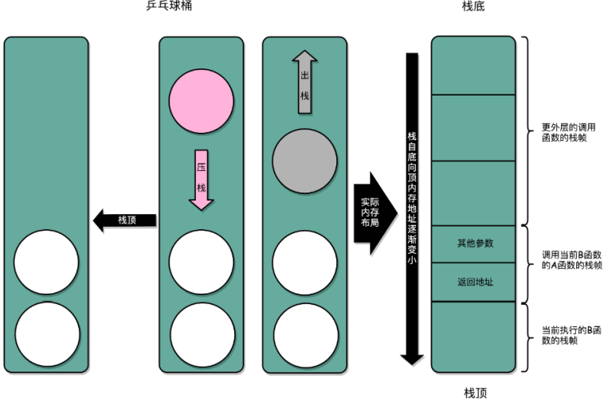
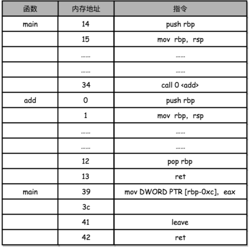

函数调用

每次调用函数之前，先把调用返回后（函数调用的下一行代码）的地址压栈，当函数执行完成（遇到`}`）时将栈中的数据弹出。然后使得CPU跳转到新的指令地址。



程序代码

```C
// function_example.c
#include <stdio.h>
int static add(int a, int b)
{
    return a+b;
}
 
 
int main()
{
    int x = 5;
    int y = 10;
    int u = add(x, y);
}
```

汇编代码

```assembly
int static add(int a, int b)
{
   0:   55                      push   rbp
   1:   48 89 e5                mov    rbp,rsp
   4:   89 7d fc                mov    DWORD PTR [rbp-0x4],edi
   7:   89 75 f8                mov    DWORD PTR [rbp-0x8],esi
    return a+b;
   a:   8b 55 fc                mov    edx,DWORD PTR [rbp-0x4]
   d:   8b 45 f8                mov    eax,DWORD PTR [rbp-0x8]
  10:   01 d0                   add    eax,edx
}
  12:   5d                      pop    rbp
  13:   c3                      ret    
0000000000000014 <main>:
int main()
{
  14:   55                      push   rbp
  15:   48 89 e5                mov    rbp,rsp
  18:   48 83 ec 10             sub    rsp,0x10
    int x = 5;
  1c:   c7 45 fc 05 00 00 00    mov    DWORD PTR [rbp-0x4],0x5
    int y = 10;
  23:   c7 45 f8 0a 00 00 00    mov    DWORD PTR [rbp-0x8],0xa
    int u = add(x, y);
  2a:   8b 55 f8                mov    edx,DWORD PTR [rbp-0x8]
  2d:   8b 45 fc                mov    eax,DWORD PTR [rbp-0x4]
  30:   89 d6                   mov    esi,edx
  32:   89 c7                   mov    edi,eax
  34:   e8 c7 ff ff ff          call   0 <add>
  39:   89 45 f4                mov    DWORD PTR [rbp-0xc],eax
  3c:   b8 00 00 00 00          mov    eax,0x0
}
  41:   c9                      leave  
  42:   c3                      ret    
```



main 函数调用 add 函数时，add 函数入口在 0～1 行，add 函数结束之后在 12～13 行。

调用第 34 行的 call 指令时，会把当前的 PC 寄存器里的下一条指令的地址压栈，保留函数调用结束后要执行的指令地址。

而 add 函数的第 0 行，push rbp 这个指令，就是在进行压栈。push rbp 就把 main 函数的栈帧的栈底地址，压到栈顶。

>  rbp 又叫栈帧指针（Frame Pointer），是一个存放了当前栈帧位置的寄存器。

第 1 行的一条命令 mov rbp, rsp ，把 rsp 这个栈指针（Stack Pointer）的值复制到 rbp 里，

> rsp 始终会指向栈顶。

rbp 这个栈帧指针指向当前最新的栈顶，也就是 add 函数的栈帧的栈底地址了。

函数 add 执行完成之后，将调用第 12 行的 pop rbp 来将当前的栈顶出栈，然后调用第 13 行的 ret 指令，同时要把 call 调用的时候压入的 PC 寄存器里的下一条指令出栈，更新到 PC 寄存器中，将程序的控制权返回到出栈后的栈顶。