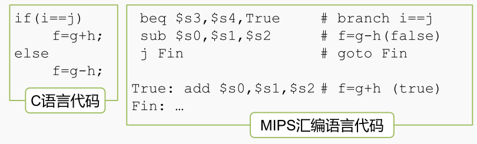
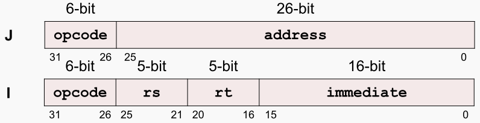

分支指令

分支指令 是用于改变控制流的指令，其实就相当于X86当中的转移指令。 在MIPS中，分支指令也分为条件分支，和非条件分支 两种。
Conditional Branch 条件分支：根据比较的结果改变控制流。 两条指令： branch if equal (beq) ； branch if not equal (bne)
Unconditional Branch 非条件分支：无条件地改变控制流。 一条指令： jump (j)

## 条件分支
◦ beq rs,rt,imm # opcode=4
◦ bne rs,rt,imm # opcode=5
格式：`beq reg1,reg2,L1` if (value in reg1)==(value in reg2) goto L1

目标地址计算方法：
◦ 分支条件不成立，PC = PC + 4 = next instruction
◦ 分支条件成立，PC = (PC+4) + (immediate*4)

> CPU会判断第一个寄存器当中的数 和第二个寄存器当中的数是否相等。如果相等就跳转到 L1所指向的寄存器单元取出下一条指令，否则， 顺序执行deq之后的那条指令。
>
> 和X86的条件转移指令有很大的不同，MIPS没有标志寄存器，在 一条指令当中即进行了比较，又完成了转移

条件分支指令的示例

## 非条件分支指令（ J 型）

扩大目标地址范围，理想情况，直接使用 32-bit 地址，冲突： MIPS 的指令长度固定为 32-bit ，opcode占用了 6-bit
目标地址计算方法：New PC ={(PC+4)[31..28], address, 00}

J 型指令的目标地址范围：± 2 28 bytes （± 256MB ）
如何到达更远的目标地址， 2 次调用j指令 或使用jr指令：jr rs