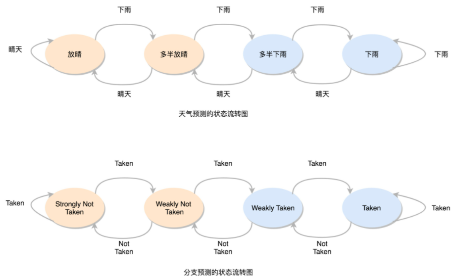

分支预测

**静态分支预测**，认为跳转一定不发生（有50%的准确率）。按照顺序，把指令往下执行。

如果预测错误，后面已经取出指令已经执行的部分，给丢弃掉（ 在流水线中叫Zap 或者 Flush）。此时CPU 不仅要执行后面的指令，对于这些已经在流水线里面执行到一半的指令，我们还需要做对应的清除操作。比如，清空已经使用的寄存器里面的数据等等。

**动态分支预测**，

**一级分支预测**（One Level Branch Prediction），或者叫**1 比特饱和计数**（1-bit saturating counter）：用一个比特，去记录当前分支的比较情况，直接用当前分支的比较情况，来预测下一次分支时候的比较情况。

**2 比特饱和计数**，或者叫**双模态预测器**（Bimodal Predictor）：2 个比特来记录4个状态。

如果连续发生下雨的情况，认为更有可能下雨。之后如果只有一天放晴了，仍然认为会下雨。
在连续下雨之后，要连续两天放晴，才会认为之后会放晴。

