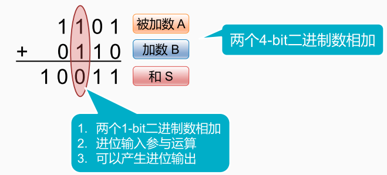

手工二进制加法

> 逢二进一

与十进制的加法过程相似，其中被加数是1101，加数0110，首先从最低位开始1加0等于1，然后第二个0加1等于1；第三个1加1所以这里应该计为0并有一个进位。我们暂且记下，然后再算最高位 

再算最高位1加0本来应该等于1，还要加上一个进位，所以应该等于0。 再往上进一位，这就是最后的（和）。因此，对每一位的相加来说实际上要做这么几项工作：

首先要完成两个一位的二进制数的相加。 

其次可能有从进位传进过来的进位要参加运算，最后还有可能产生进位的输出。 

[[二进制加法电路]]

[[减法运算]]

[[加法器的优化]]