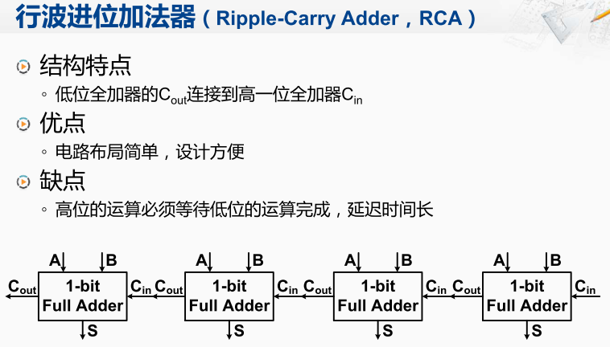
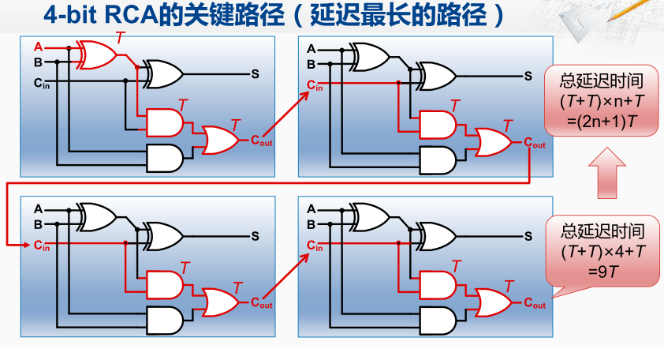
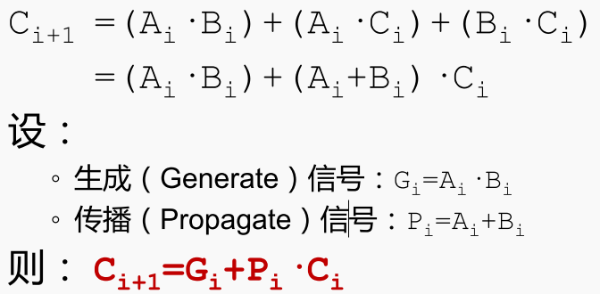
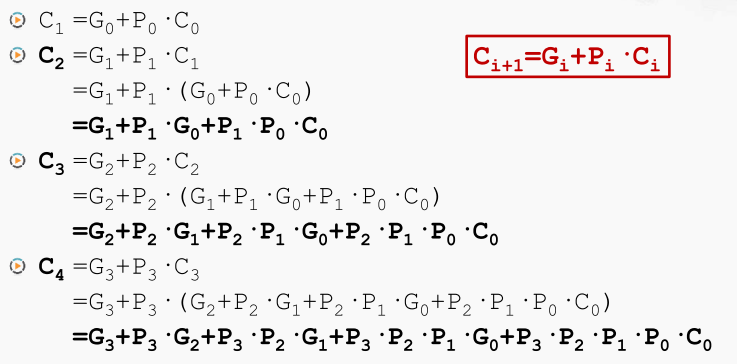
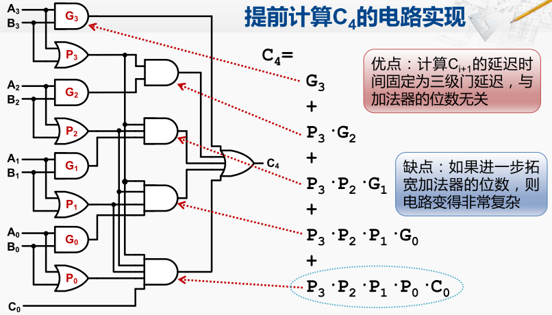
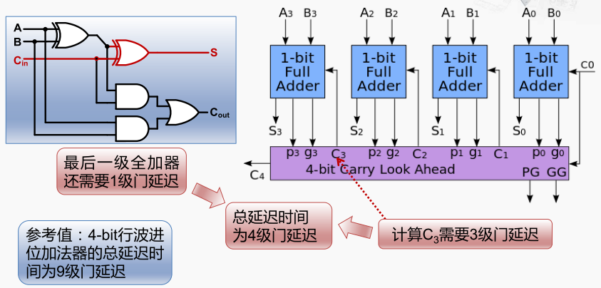

加法器的优化

在四位加法器中通过连接四个全加器构成。这4个全加法器只能从左至右一个个的进行运算，即当输入A和B准备好时C in需要等前一个全加器完成后才能计算处理。只有等他将进位的输出，传接到下一个全加器后，下一个全加 器才可以开始运算，进而产生新的进位输出。 这样进位输出，依次从低位到高位传递，像波浪一样因而得名为行波进位加法器（RCA）。 缺点：高位的运算必须等待低位的运算完成从而加剧了整个加法器的延迟。

行波进位加法器的性能分析

要对一个电路的性能进行分析，就要找出其中的最长路径。 即找出所有的从输入到输出的电路连接中，经过 的门数最多的那一条，也被称为关键路径（下图红线所示）。

我们来做一个简单的分析， 对于最低位的全加器，它在A、B和C in都已经准备好，其实，输入信号进入到这块电路之后，在连接线上传递需要花时间。 称为线延迟，而经过这样的门，也需要花时间，称为门延迟。

在进行设计原理分析时，我们主要关注门延迟。 

第一个全加器的`s`输出，需要通过两个门的延迟。 而C out 要经过三个门延迟。因此最长路径的延迟为3个门延迟。

第二个全加器的C in 连接的与门需要等待第一个全加器的3个门延迟，而与门对应的另一个输入只需要1个门延迟就到达。因此第二个全加器的最长路径为C in连接与门的那条路径。依次类推第三个...第n个全加器。

如果我们把每一个门延迟都记为T的话， 首先在每个全加器内部，都要经过2T个延迟，然后还 要加上最开始的这一个门延迟，因此就可以计算出，总门延迟时间 就是2T乘以全加器的数量，在加上1T。 对于四位的形波进位加法器，一共是九个门延迟， 那如果是N位的形波进位加法器 那就一共是2N+1个门延迟， 这样对于32位的形波进位加法器来说， N就等于32，所以一共是65个门延迟。所以影响性能的核心问题，就在于高位的运算，必须要等待低位的进位输出讯号。 

输出信号分析

如果全加器的三个输入， Ai，Bi或着Ci，只要任义其中两个为一，则进位就是1。因此Ci+1，Ci+1的计算表达式如下：

首先，C1是通过G0、P0和C0计算出来的，那么在运算之初，G0和P0都是已知的，C0也是已知的。 所以C1不用进行任何的等待，直接就可以计算出来， 而C2，是由G1、P1和C1运算而得的。 在这里G1和P1都是已知的， 且C1 = G0 + P0·C0。以此类推

所以通过这样的转换， 就可以提前计算所有的进位输出信号的方法。 

提前计算Ci的电路实现

将C4的这个表达式写成竖排的形式，它对应的硬件电路如下图所示， 可以看到，最外层一共有五组元素进行 或运算，对应了最后的这个五数字的或门。 

第一个元素是G3，G3就是A3和B3的与， A3和B3经过了一个与门， 与门的输出直接连到了最后的这个或门上。 

第二个元素是P3和G2的与，其中一个输入是P3， 而P3是A3和B3的或。另一个输入是G2， G2是A2和B2的与。 

由此类推，计算任意一级的进位输出都只需要三级门延迟，与加法器的位数无关。但只是如果进一步拓宽加法器的位数，像这样最后的算式 会变得越来越长，对应的电路就会变得越来越复杂。这种提前计算进位输出的方法，被称为超前进位加法器 CLA。

这就是一个四位的超前进位加法器。 

它仍然由四个全加器构成，但是每个全加器的进位输入来自一个统一的逻辑。对于每一个进位， 其实都只需要三级门延迟就可以计算出来。然后进入到全加器当中， 还需要经过一级门延迟才可以计算出对应的S信号。因此，对于超前进位加法器总的延迟时间为4级的门延迟，且超前进位加法器它的门延迟与加法的位宽是没有关系的。

由于实现全32位超前加法器会导致电路变得复杂，因此通常32位的加法器是采用多个小规模的超前进位加法器拼接而成一个较大的加法器，比如说，要生成一个32位的加法器，我们可以先做一个8位的超前进位加法器， 然后将四个八位的超前进位加法器用行波进位的方式连接起来，从而构成一个32位的加法器。 
