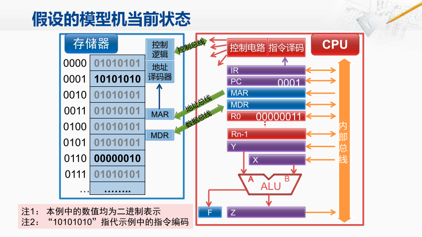
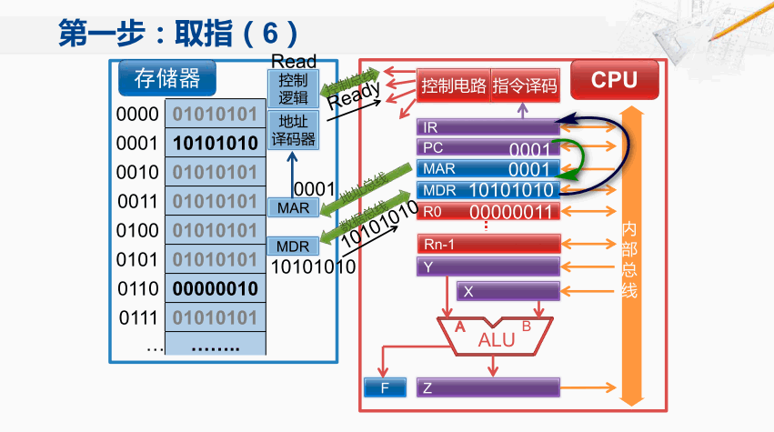
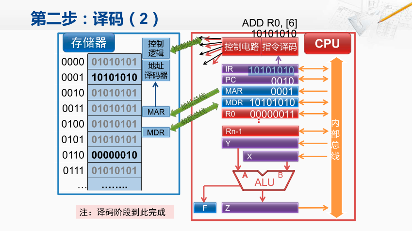
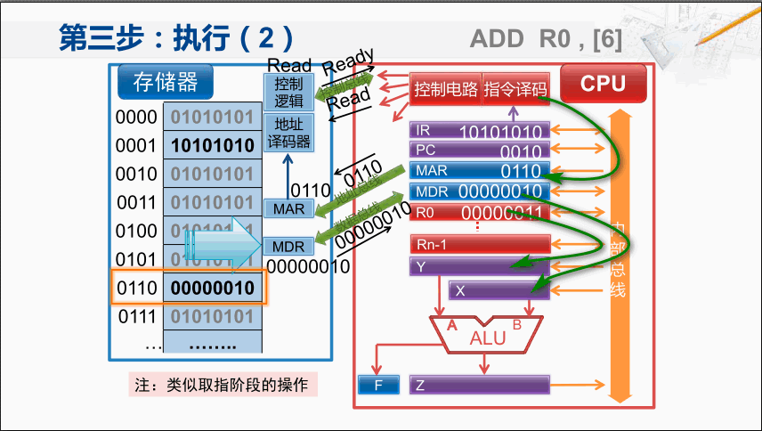

假设需要执行命令：`ADD R0 [6]` 
ADD 表示加法指令，包含两个元操作数， 其中一个就是通用寄存器R0的内容；
[6]，地址为6的存储单元中的内容。在这种格式指令当中，
默认第一个操作数即是原操作数又是目的操作的。因此运算结果就会更新到通用寄存器R0中。 

假设模型机的当前状态已经有了一些初始值：

CPU中的R0 所保存的值是00000011，这等于10进制的3。 存储单元地址为6的 存储单元的内容是00000010， 相当于10进制的2。 PC寄存器也就是指向下一条指令地址 0001。

`ADD R0 [6]`，表示把存储单元[6]的数和R0当中的数相加，最后再放到R0中。 

## 取指

控制器将**指令的地址**送往存储器，存储器按给定的地址读出指令内容，送回控制器

1. 控制器会发出控制信号将PC 寄存器中的内容通过**内部总线**传送到MAR中。 即此时MAR寄存器中也保存了0001。 

2. MAR 将这个地址送到**地址总线**上，与此同时控制电路会在控制总线上发出读数据的控制信号。
此时存储器端的MAR寄存器就会收到地址总线上传送来的地址并把它保存下来。 

3. 存储器中的控制逻辑也会收到控制总线中传送来的读数据的控制信号。 
此时存储器通过地址译码器后查找到对应地址001的存储单元的内容； 并将该存储单元的内容送到MDR寄存器中。
然后，存储器的控制逻辑，会通过控制总线将CPU反馈当前的传输已经准备好了， 同时，MDR之中的内容也会送数据总线上。 
随后，CPU中的控制电路检测到来自控制总线的准备好的信号。 因此 MDR寄存器就会将当前数据总线上传送来的数值保存下来

4. 将MDR中的内容传送到指令寄存器中，也就是IR寄存器。 

5. 将PC寄存器更新为下一条指令所需要访问的地址。 刚才是0001，现在变成0010, 也就是10进制的2 。

## 译码

1. 控制器分析指令的操作性质
2. 控制器向有关部件发出指令所需的控制信号

控制器会分析指令的<u>操作性质</u>并向相关的部件发出指令所需的控制信号。 当前的指令寄存器IR中的指令编码会送到指令译码部件进行译码。 

## 执行

1. 控制器从通用寄存器或存储器取出操作数
2. 控制器命令运算器对操作数进行指令规定的运算

## 回写

将运算结果写入通用寄存器或存储器

回写，将运算结果写入到通用寄存器或者储存器。 

