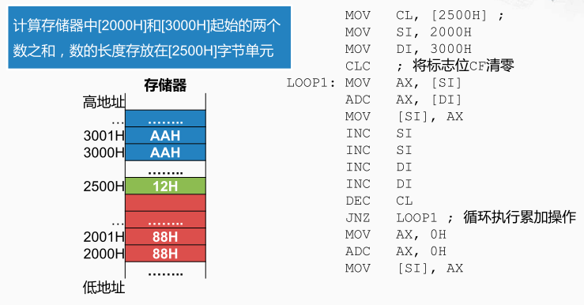
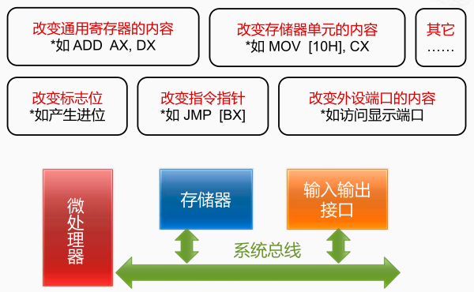

加法程序

第一个数存放在2000H开始的存储器空间中，第二个数存放在3000H开始的存储器空间中。这两个数的长度存放在字节单元2500H中。假设存储器单元中，
从2000H开始，若干个字节存放在第一个数，从3000H开始的若干个字节存放在第二个数。字节单元2500H的值为16进制的12H（$2 * 16^0 + 1 * 16^1$），也就是十进制的18。

`MOV  CL, [2500H]` 将存储器地址为2500H对应的数传送到CL寄存器中

`MOV  SI, 2000H` 将立即数2000H传送到SI寄存器中。

`MOV  DI, 3000H` 将立即数3000H传送到DI寄存器中。

因此SI和DI这两个寄存器就分别保存了接下来要计算的这两个数的起始地址。

`CLC`   将标志位CF清零。避免在使用ADC指令时传入不需要的进位。

`LOOP1: MOV  AX, [SI]`将SI寄存器所指向的内存单元的数传送到AX寄存器中，也是将第一个数传送到AX寄存器当中，然后用

`ADC AX, [DI]` 将 AX寄存器当中的内容和DI所指向的内存单元中的内容相加， 结果依旧保存在AX寄存器中。将低位产生的进入传递到下一次加法中。

`MOV [SI], AX`将AX寄存器中的内容传送到`SI`所指向的内存单元。

这样我们就完成了第一个字的累加。然后我们执行了两次INC指令去递增SI寄存器，然后用两个INC指令递增了DI寄存器，这就为下一轮的累加做好了准备。

`DEC  CL` 将CL寄存器的内容减1，由于CL寄存器中存放的是这个数的长度， 将它减1就说明我们已经完成了其中一个字的累加工作。那如果减完之后，CL寄存器当中的值不为0， 说明还需要继续累加。
`JNZ LOOP1` 跳转到LOOP1这个标号继续执行，它所检查的条件 就是之前指令的运算结果是否为0。准确地说它是去检查标志寄存器当中的标志位是否为1。

当CL寄存器的内容 不为0的时候，说明这个数的累加工作还没有做完， 那我们会跳回到LOOP1的标号这里继续做下一次的累加， 直到某一次CL减到0了，那这个条件转移指令的条件不满足， 

无论是哪一类指令，我们首先要关心的就是它究竟改变了什么哪些地方，及对后续的指令会产生什么样的影响。

