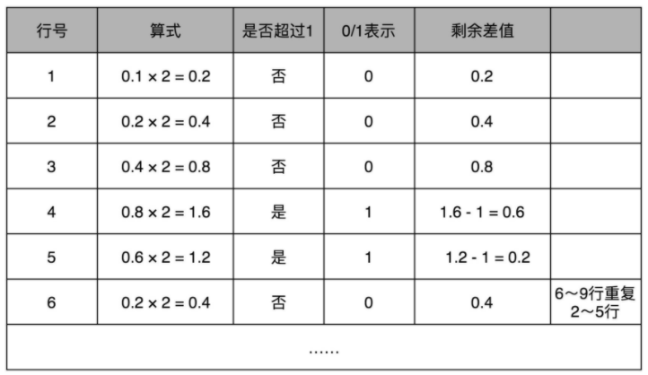
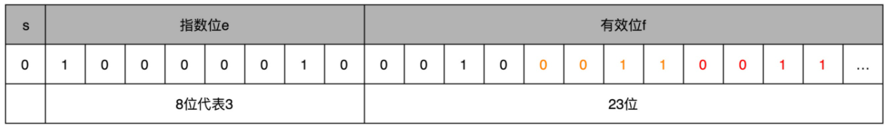

### 十进制转二进制

整数部分：采用<u>除以 2，然后看余数</u>，

小数部分：首先<u>乘以 2，然后看是否超过 1</u>，如果超过 1则记下 1，并把结果减去 1，依次类推

比如0.1转出二进制的过程如下：

最终0.1 变成了一个无限循环的二进制小数，0.**0**<u>0011</u>0011。这里的“0011”会无限循环下去。

### 9.1 的二进制科学计数法表示

整数部分9 => 1001，小数部分 0.1 => 0.0<u>0011</u>0011。因此9.1的二进制科学计数法表示为 1.001 **0** <u>0011</u> 0011...×$2^3$

符号位 s = 0，

有效位 f = 0010**0011**0011…。因为 f 最长只有 23 位，那这里“0011”无限循环，最多到 23 位就截止。于是，f=0010**0011001100110011** **001**。最后的一个“0011”循环中的最后一个“1”会被截断掉。

对指数位 e = 3（在二进制1001将小数点右移，1.001）。因为指数位有正又有负，所以指数位在 127 之前代表负数，之后代表正数，那 3 其实对应的是加上 127 的偏移量 130，转化成二进制，就是 130，对应的就是指数位的二进制，表示出来就是 1000**0010**。

