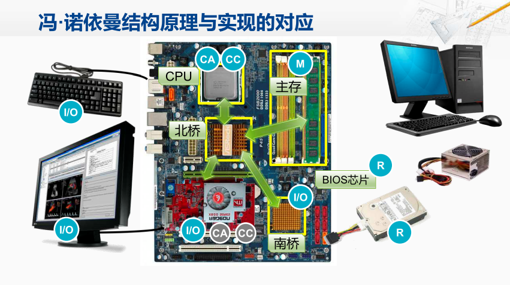
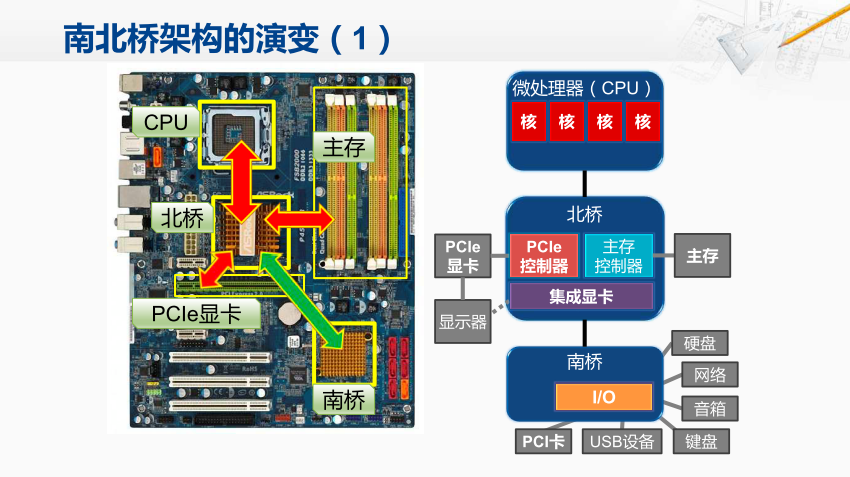
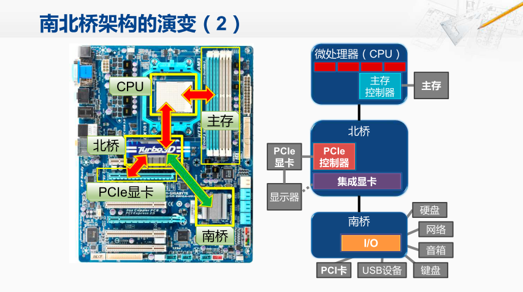
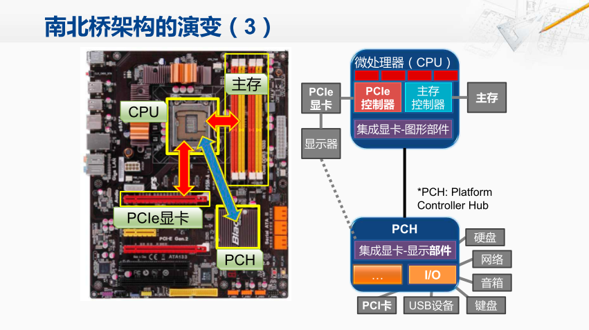
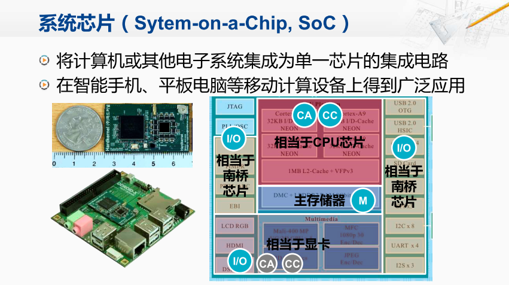

南北桥结构

南北桥结构在个人计算机上长期占主导地位。CPU对外会连接的一块叫北桥的芯片。CPU通过北桥芯片访问主存、显卡、南桥等。南桥主要用于继承输入输出设备的控制器，其中就包括硬盘的控制器。

BIOS芯片，与南桥相连，且存储容量很小的只读存储器（断电不会丢失数据）， 用于保存的一段比较简单但十分重要的程序，包括检查主板上都有哪些设备， 这些设备工作是否正常。 当计算器启动后，CPU可以依次通过北桥， 南桥，访问到BIOS芯片，从里面取得指令。 

我们先来看右侧这张图， 最上方是微处理器，也就是CPU。 这颗芯片中，往往包含着多个CPU核。 往下，它连接着北桥。 北桥中，主要会有主存控制器，对外连接着主存，那现在的显卡，一般采用PCIE接口，所以在北桥中，会集成PCIE控制器， 对外通过PCIE的插槽，连接PCIE的显卡。当然如果你对显示的性能要求不高， 也可以通过北桥内部自带的集成显卡，直接连接显示器。 那北桥还连接着南桥，南桥中，集中了大多数 I/O设备的控制器。

那我们再来看左边这张图。 CPU对外的访问都需要通过北桥， 而其中对传输的性能要求最高的就是与主存的这条通道。主存通道的性能也成为了整个计算机性能的关键瓶颈。 除此之外，另一条对性能影响很大的通道就是显示通道。 那么这就是PCIE的插槽，这上面可以插上PCIE显卡。再有一条重要的通道， 就是北桥与南桥的连接，通过这条通道， 外部的输入输出设备可以对主存进行访问。红颜色的箭头表示传输压力很大的通道，而南北 桥之间的绿色箭头表示这条通道传输压力相对较小。

> 在现在高性能的超级计算机中，GPU也承担了运算器和控制器的一些功能。 

南北桥架构上，发生的第一个重要的变化， 就是北桥中的主存控制器被移到了CPU芯片当中。 通过左边这张图，我们也可以看出来， CPU的插槽与主存的插槽变得更近了， 这就是因为现在CPU是直接访问主存，而不需要再通过北桥了。 这样可以大大地提高数据的传输率，进而提升系统的性能。 

现在，显示的这条通道，就成为了下一个要解决的问题。 因此，在最新的个人计算机的CPU设计中，不仅包括了主存控制器，还包含了PCIE控制器，在外部可以直接连接显卡。 北桥当中最重要的一些部件，都被集成到了CPU芯片当中。 于是将北桥中剩余的一些功能，和南桥芯片整合到一起之后，所谓南北桥的架构， 其实已经消失了。整个个人计算机的主板由三片式的架构缩减成了两片式。 

那我们再看左边这张图， 现在CPU直接连接着主存， 还直接连接着显卡， 还与原先的南桥直接相连， 这样就将原先通过主板的复杂的通路，大多移到了芯片的内部。 而芯片内部的数据传输率，是远远高于主板的。 这样就大大地提升了系统的性能。

 系统芯片， 将计算机系统或其它电子系统集成到一个单一的芯片上。

