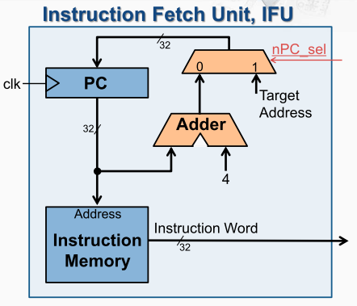

## 取指单元

取指令：通过 PC 的内容作为地址，访问指令存储器获得指令编码

更新程序计数器（ PC ）：顺序执行时， PC = PC + 4；发生分支时，PC =分支目标的地址

> 在MIPS指令系统当中，每一条指令都是4个字节的，PC = PC + 4

在系统启动时给PC寄存器一个合适的初始值，并在指令存储器中存放需要运行的指令，然后在运行的过程中，给出合适的多选器的选择信号，
就可以在时钟信号的驱动下自动的连续工作起来。 

IFU作为一个整体，由一个时钟信号和一个选择信号的输入，以及指令编码的输入构成。 当前PC寄存器的内容既会送到指令存储器，以获得指令的编码，也会送到加法器的输入，从而计算出一个PC + 4的值。在下一个时钟上升沿到来的时候， PC寄存器就会重新将PC+4的值存入其中，并同时送到指令存储器和加法器，如此周而复始，就完成了每个时钟上升沿时，更新PC寄存器的内容，以及送出新一条指令的二进制编码。 

