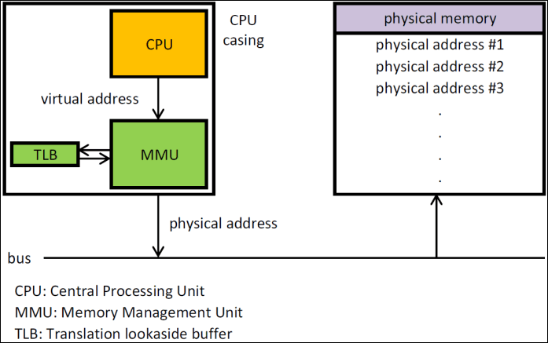
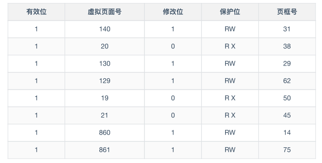
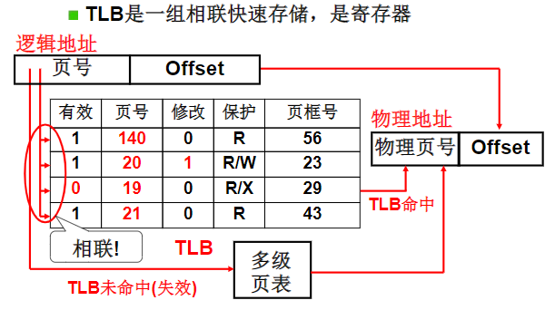

**地址转换高速缓冲**（Translation-Lookaside Buffer）位于CPU的MMU中，用于存放之前已经进行过地址转换的查询结果，当同样的虚拟地址需要进行地址转换的时，可以直接在 TLB 里面查询结果。（空间局部性原理）TLB基于电路的相联特性可以很快定位到具体的页框号（如果存在）。

MMU中的虚拟地址转换步骤：

通过硬件检查虚拟页号与TLB中所有表项进行并行匹配，判断虚拟页是否在TLB中。如果找到了有效匹配项，并且要进行的访问操作没有违反保护位，则将页框号直接从TLB中返回，否则返回一个保护错误。
如果不在则从内存中进行加载。

> 多级页表的引入增加的虚拟页号映射到物理页框的查询时间。因此引入了TLB，TLB利用电路相联的特性可以很快找到页框号。
>
> 

