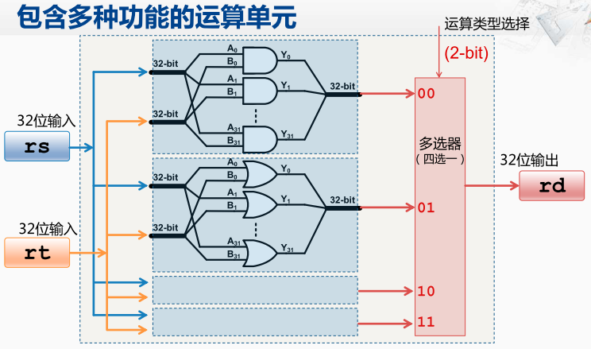
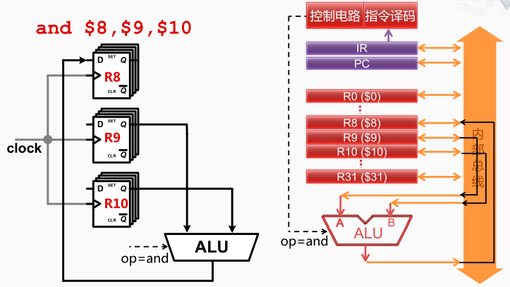

## 多功能运算单元

首先包含一个32位的输入，然后在运算单元的内部， 分别连接到各个不同的运算功能部件的A输入端口，

然后将另一个32位的 输入也在运算单元的内部分别连接到各个不同功能单元的B输入端口。 

这样每个功能部件都按照各自的功能完成对应的与操作，或操作， 以及其他的操作，并产生对应的运算结果。

最终通过多选器选择一个对应的运算类型所产生的结果。经过这个多选器之后，就可以产生一个32位的输出。

> 比如ALU中包含四种功能（会产生四个运算的结果），因此要经过一个四选一的多选器从四个选择当中选出一个。

如果要执行指令`add $8, $9, $10`，实际上是在控制电路的控制下将9号和10号寄存器的内容分别连接到ALU的两个输入端， 控制电路依据操作类型（and）给出对应的选择选择信号。最后控制电路还会将ALU的输出与8号寄存器的输入相连。 

> 8号寄存器、9号寄存器、10号寄存器都可以看作由32个D触发器组成。

9号，10号寄存器的Q端的输出会被链接到ALU的两个输入， 同时ALU的功能选择信号输入了与运算所对应的编码。 
然后ALU的输出会被连接到8号寄存器的输入D端。所以在某一个时钟周期内，ALU会按照输入的要求 完成相关的运算，并将运算结果送到输出信号上。 
输入结果经过连线的传送， 会送到8号寄存器的输入端， 等到下一个时钟上升沿来临的时候， 8号寄存器就会将输入端的信号采样，存入到寄存器内部，并会在输出端表现出来。 