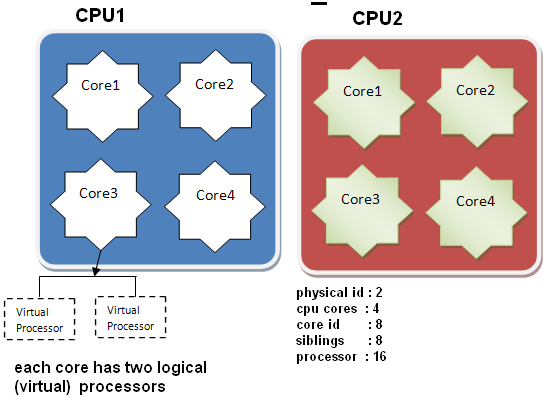

## CPU物理架构

在linux中通过命令 cat /proc/cpuinfo 查看cpu信息。

| 参数        | 说明                                                         |
| -- | --- |
| processor   | 逻辑处理器的id。|
| physical id | 物理封装的处理器的id。|
| core id   | 每个核心的id。|
| cpu cores   | 位于相同物理封装的处理器中的内核数量。|
| siblings  | 位于相同物理封装的处理器中的逻辑处理器的数量（超线程技术，virtual processor）。 |

物理 cpu 数（physical cpu）：指主板上实际插入的 cpu 硬件个数（socket）。
CPU总核数 = 物理CPU个数 \* 每颗物理CPU的核数 siblings 
总逻辑CPU数 = CPU总核数 \* 超线程数

[[超线程技术]]

