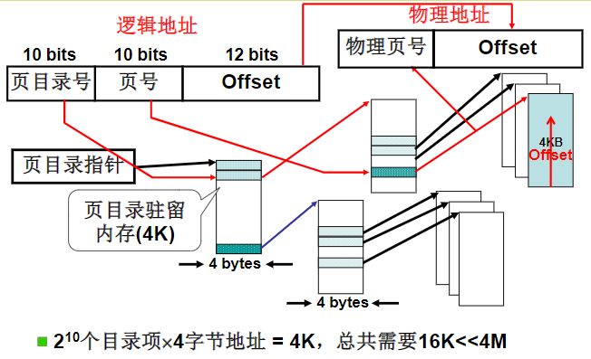

将连续得页号拆分为多段，在每级页表上按顺序不间断存储，在下一级页表上可以只存储虚拟页号与物理页框号对应的数据（为空的页表将不存储减少空间）。

> 与书目录上的章节类似，对于CPU而言从内存中加载值并判断相对比较缓慢。因此必须使用顺序不间断存储，查找时可以直接计算出偏移量而不需要比较。
> 减少CPU访问内存的速度

假设一个进程会有一个 4 级页表。先通过 4 级页表索引，找到 4 级页表里面对应的条目（Entry）。这个条目里存放的是一张 3 级页表所在的位置。4 级页面里面的每一个条目，都对应着一张 3 级页表，所以我们可能有多张 3 级页表。剩下的以此类推，直到最后一层的 1 级页表里面的条目，对应的数据内容就是物理页号。

