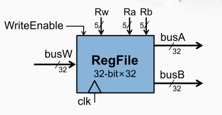

## 寄存器堆
每个寄存器为 32 位宽，共 32 个， 支持读操作： rs 和 rt， 支持写操作： rt 或 rd。称为“两读一写”的寄存器堆

数据接口信号：busA ， busB ：两组 32 位的数据输出，busW ：一组 32 位的数据输入。

### 读写控制
Ra(5 位 ) ：5位的信号(与32寄存器对应)，寄存器堆会根据Ra的输入，选择对应编号的寄存器，将其内容放到busA信号上

Rb(5 位 ) ：同上，只是将其内容放到 busB

Rw(5 位 ) ：寄存器堆会根据Rw的输入，选中对应编号的寄存器。在时钟信号（ clk ）的上升沿，如果写使能信号有效（ WriteEnable==1 ），则寄存器堆就会将busW信号上的内容存入Rw信号所指定的寄存器。

> 寄存器堆的读操作不受时钟控制，在任何时候，就让Ra 或者Rb发生了变化，那对应的busA和busB的信号就会发生变化。 

