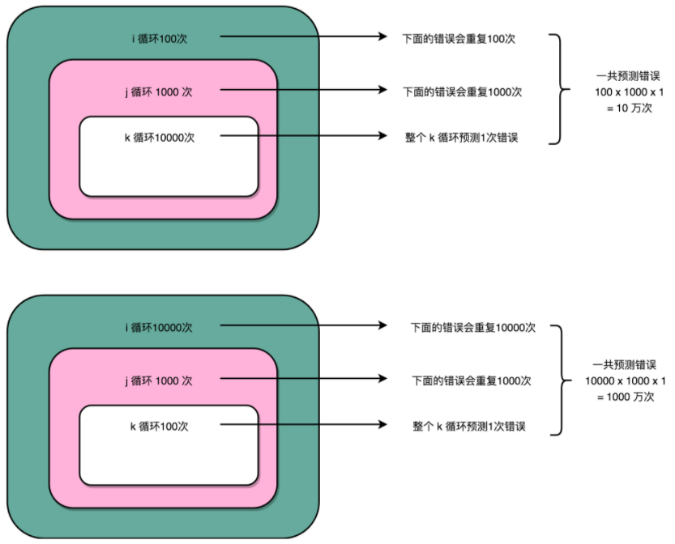

分支预测对嵌套循环性能影响

```java
public class BranchPrediction {
    public static void main(String args[]) {        
        long start = System.currentTimeMillis();
        for (int i = 0; i < 100; i++) {
            for (int j = 0; j <1000; j ++) {
                for (int k = 0; k < 10000; k++) {
                }
            }
        }
        long end = System.currentTimeMillis();
        System.out.println("Time spent is " + (end - start));
                
        start = System.currentTimeMillis();
        for (int i = 0; i < 10000; i++) {
            for (int j = 0; j <1000; j ++) {
                for (int k = 0; k < 100; k++) {
                }
            }
        }
        end = System.currentTimeMillis();
        System.out.println("Time spent is " + (end - start) + "ms");
    }
}

// result
// Time spent in first loop is 5ms
// Time spent in second loop is 15ms
```

同样循环了十亿次，第一段程序只花了 5 毫秒，而第二段程序则花了 15 毫秒，足足多了 2 倍。
分支预测，每一次循环都有一个 cmp 或 jle (jump if less or equal) ，即要比较条件码寄存器的状态，用于决定是顺序执行代码还是要跳转到另外一个地址。




假设采用静态分支预测，认为一定不为发生跳转。

上面的第一段循环，
第三层 k 循环每隔 10000 次，会发生一次预测错误
在第二层 j 循环每隔 1000 次，会发生一次预测错误
第一层的 i 的循环是 100 次。
每个外层循环一次里面，都会发生 1000 次最内层 k 的循环的预测错误，
所以一共会发生 100 × 1000 = 10 万次预测错误。


内存 k 的循环 100 次的代码，则是每 100 次循环，就会发生一次预测错误。
在第二层 j 的循环发生的次数，还是 1000 次。
最外层 i 的循环是 10000 次，
所以一共会发生 1000 × 10000 = 1000 万次预测错误。